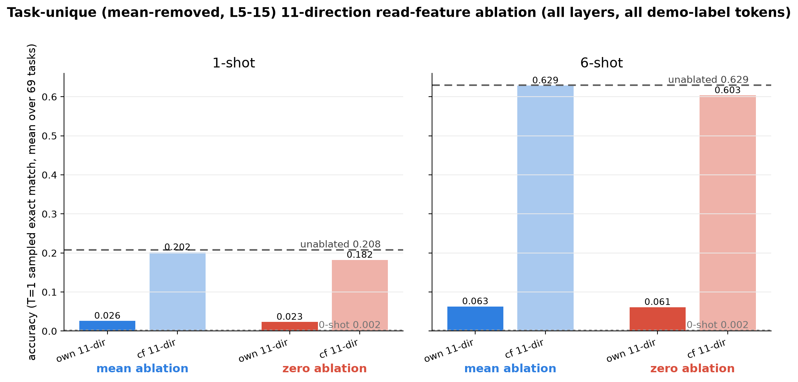
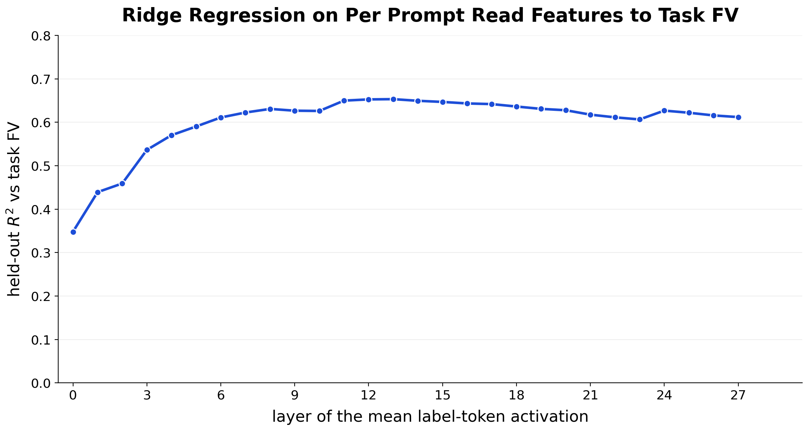

# Read and Write Features for In-Context Learning

## Abstract
(TBD)

## Introduction
We study how models learn in context. Namely, previous work has shown the existence of "function vectors" which are the write features that are causal representations of functions at the tokens directly prior to the output of the function. We define this as the write feature so that we can introduce the concept of read features which are representations that the model uses to infer the task, but not actually imitate it. The **read feature** sits at demonstration label tokens in the early layers, and is causal in forming the **write feature** at cue tokens in the middle layers and drives the answer. We show that both are causally necessary and sufficient and various claims about the nature of these features and their relationship.

## Related Work
(TBD)

## Setup

- **Model:** GPT-J-6B (28 layers × 16 heads).
- **Tasks:** 69 word-level ICL tasks (translation, morphology, world knowledge, string ops,
  classification, numerical); fixed split of 55 train / 14 held-out tasks
- **Write feature:** the function vector $v_A = \sum_{h \in H} \bar h_A$: the sum of 37
  attention heads' mean final-cue-token outputs for task $A$. The head set $H$ is selected
  once, by pooled sparse optimisation on the 55 train tasks only.
- **Read feature:** the task-mean residual-stream activation at demonstration *label*
  tokens, layer 6 ($m_A(\mathrm{L6})$). A raw mean — no head selection, no differencing.
- **Readout:** 150 fixed prompts per task; temperature-1 sampled exact-match accuracy.
  $\alpha$ is the injection scale for steering.
## Terminology

## 1. Write features generalise to unseen tasks

The 37-head set is chosen on the 55 train tasks only, yet summing those heads' mean
activations gives a steering vector for *any* task, including the 14 the selection never
saw. Injected at the final cue token of a zero-shot prompt, the task's own $v_A$ takes
held-out tasks from 0.09 to 0.73 — indistinguishable from train tasks (0.75) — and every
single one of the 69 tasks improves in both test settings (mixed-task 10-shot: 0.68 train /
0.78 held-out from a 0.18 base; minimum zero-shot lift +0.30).

*Steering with the train-selected 37-head write feature transfers to held-out tasks; the
per-task view shows the lift is universal and held-out tasks interleave with train.*

## 2. Write features are low dimensional

**Across the pool: a 22-dimensional subspace carries most of the steering.** The top 22
uncentered PCs of the 69 task-mean function vectors (90% of their energy) define one fixed
subspace. Projecting each task's $v_A$ into it and rescaling the strength per task
($\alpha$ up to 2, since projection shrinks the norm) recovers zero-shot steering of 0.68
on both train and held-out tasks, against 0.75 / 0.73 for the full 4096-dimensional
vectors — and the train/held-out gap vanishes entirely.

**Per task: a single direction, with bidirectional control.** For an individual task the
write feature is effectively rank one. The same unit direction $\hat v_A$ that steers
zero-shot prompts (sufficiency) is also necessary: zero-projecting it out of the residual
stream at just the final cue token collapses 6-shot ICL from 0.639 to 0.013 — the
zero-shot floor. The kill is task-specific: ablating a counterfactual task's direction
costs only 0.16, and mean-ablation (which keeps the generic cue-token content) shows the
same own-vs-counterfactual gap (0.242 vs 0.616). The same holds on 1-shot prompts
(baseline 0.211): own-FV zero-ablation lands on the floor (0.001) while the counterfactual
direction leaves 0.107 and counterfactual mean-ablation leaves the baseline intact (0.205).

*Removing one direction at one token position destroys ICL — at 6 shots and at 1 shot —
only for the task that owns the direction (layer clamp 9–27).*

## 3. Read features exist: task identity is linearly present at label tokens, early

For every (token position, layer) cell, a ridge regression maps that single activation to
the prompt's function vector; fits use train tasks only and are scored on held-out tasks.
The pattern locates where the model can read the task off the prompt: demonstration
*label* tokens are predictive from the very first example (peak held-out $R^2$ 0.688 at
L15, late-demo pre-label), while the "A:" cue token starts dead and only catches up after
several examples have established the task (the sawtooth). Input tokens carry essentially
nothing at any layer (held-out $R^2$ −0.24…+0.03); the embedding-only baseline at label
tokens is 0.245.

*Labels are informative from example 1; the cue catches up example by example. The bright
band is pre-label and label positions of later demos at layers ~8–17.*

## 4. Read features are causal to the output

**Sufficiency.** The causal test replaces information with the feature: demonstrations keep
their real inputs but every label is a bare `_`, so the prompt teaches nothing (unsteered
accuracy 0.000). Injecting $\alpha \cdot m_A(\mathrm{L6})$ at the dummy label slots
restores the task. L6 is not assumed — it is selected by a full injection-layer sweep
(all 28 layers, 1-shot scaffold, best $\alpha$ per layer): steering works only in a narrow
early-layer window, peaking at L6 (0.126, with L7 at 0.125), collapsing to 0.010 by L12
and to the ~0.003 floor everywhere later. A task-agnostic shared-mean control never
exceeds 0.013 at any layer, so task identity, not generic label-token content, carries the
effect. With six dummy slots steered at $\alpha=4$ the model recovers 70% of what six
*real* demonstrations deliver (0.000 → 0.442 vs the 0.630 real 6-shot reference).

**Necessity (bidirectional control).** The naive controls fail for a structural reason:
read features are far more similar across tasks than function vectors are (mean pairwise
cosine 0.727 vs 0.393), so a counterfactual-task ablation removes much of the *same shared
direction* as the own-task ablation — zero-projecting either direction at the label tokens
kills ICL (own 0.009, counterfactual 0.278 from a 0.629 baseline). The shared label-token
component is load-bearing but carries no task identity.

Splitting the read feature accordingly — a shared carrier plus a *task-unique* part (§5) —
resolves the control problem completely. Ablating the task's mean-removed 11-direction
basis (top per-task directions of the L5–15 label-token means after removing each layer's
cross-task mean) at demo label tokens collapses 6-shot ICL to 0.063 while the
counterfactual task's basis leaves it at 0.629 — exactly baseline. The same double
dissociation holds at 1 shot (own 0.026 vs counterfactual 0.202, baseline 0.208). And the
necessary object is genuinely low-rank: the top-3 SVD compression of that basis is a
drop-in match (0.066), the top single direction alone removes ~84% of ICL (0.103), and
restricting the basis to layers 6–9 nearly suffices (0.096).

*Left: why naive controls fail — read features overlap heavily across tasks. Right: the
task-unique basis separates cleanly. The full rank/band ladder is in Appendix F.*

## 5. The read feature = a shared carrier + a low-dimensional task-unique code

The ablation controls force a decomposition: $m_A = \bar m$ (the cross-task mean at label
tokens, cos ≈ 0.73 between tasks) + a task-unique remainder. Steering separates the roles.
On the dummy-label scaffold, the task-unique part alone recovers about three quarters of
full-vector steering (6 slots: 0.000 → 0.339 vs 0.447 full), while the shared carrier alone
does nothing (≤ 0.013 at every layer and dose). The code side compresses hard: swapping in
a *single* task-unique direction ($\alpha \cdot s_1 \cdot v_1$ at L6, all label slots)
reaches 0.341 — matching the full mean-free vector — though it ignites only at
$\alpha \approx 16$–32, well above the direction's natural per-prompt scale.

**Why does the carrier help steering if it carries no identity?** Full-vector steering
beats the task-unique part by a stable margin (~0.08–0.11). Three hypotheses tested so far
(detail in Appendix I): *base repair* — rejected: on a scaffold whose labels are real words
from other tasks' output pools, the gap is unchanged to three decimals; *attention
capture* — partial: the carrier does attract cue→label attention at L13 (0.045 vs a flat
0.038 for the code alone; real labels 0.056), but attention does not mediate accuracy — at
the accuracy-peak dose, attention is at or below unsteered; *error anatomy* — the code-only
condition's extra misses are 3× more underscore-echoes (0.055 vs 0.018) with *identical*
own-pool mapping-error rates (0.145 vs 0.137), and over half the gap is degraded on-task
attempts. The surviving interpretation is a ratio-preserving composite code: carrier and
code arrive together at a preserved proportion in natural prompts, and downstream machinery
is calibrated to that composition.

## 6. Read features cause the write feature to form

The same six-slot injection, but instead of generating, we read the residual stream at the
final cue token — the site where the write feature forms. As $\alpha$ increases, the
cue-token representation rotates toward the task's own function vector: cosine at L13
doubles from 0.18 to 0.37 between $\alpha=0$ and $\alpha=2$. The rotation is task-specific
— the gain over alignment to a generic all-task FV is positive on 69/69 tasks (+0.093 at
$\alpha=2$) and still rising at $\alpha=4$.

Two finer-grained variants agree. On the 1-shot scaffold the same rotation appears at half
strength ($\Delta\cos$ to own $v_A$ +0.088 at $\alpha=2$, vs +0.044 to the generic FV).
And steering *only the first* label slot shows the effect propagating forward with decay:
the task-specific excess alignment is largest at the very next cue (+0.047 at $\alpha=2$)
and falls monotonically to +0.010 by the query cue — each demonstration's label refreshes
a signal that would otherwise fade.

## 7. Read features appear earlier in the residual stream than write features

Presence maps — the mean cosine between the residual stream and each feature, by layer and
token type, over clean 10-shot prompts — separate the two features in both depth and
position. The read feature peaks at demonstration *label* tokens at layer 6 (cos 0.80);
the write feature peaks at *cue* tokens at layer 13 (cos 0.31; 0.35 at the query cue).
Reading happens where label content sits, roughly seven layers before writing happens where
the answer is produced.

## 8. Read features linearly map to write features

A single ridge regression from the mean label-token activation to the per-prompt function
vector, fit on the 55 train tasks, predicts the *held-out* tasks' function vectors with
$R^2 \approx 0.7$ (0.65 per-prompt, 0.69 at task centroids, reading from L13). The map is
one linear transform shared across tasks — it was never shown the held-out tasks' FVs, yet
it places most of them from their read features alone. The sweep covers all 28 layers:
held-out $R^2$ climbs steeply from 0.35 at L0, plateaus from L8, peaks at L12–13, and
declines only gently to 0.61 at the final layer — task identity stays linearly readable at
the label slots through the entire second half of the network.

## 9. The read→write map is, to first order, a rotation

What does that linear map actually do? Removing each family's grand mean answers it. The
two task clouds are already the *same shape*: centered pairwise cosines match pair-by-pair
(Pearson 0.93 at L6 / 0.96 at L13, gram-CKA 0.93/0.95), and even the centered norms
correlate (r ≈ 0.79). But they occupy *nearly orthogonal directions* of the residual
stream: the largest principal cosine between the two 90%-variance subspaces is 0.26 (L6) /
0.41 (L13), and each task's read feature is nearly orthogonal to its own FV (matched cos
0.08 / 0.19, vs exactly 0 for mismatched pairs).

Congruent shapes in orthogonal subspaces is precisely the geometry a rotation solves — and
it does: an orthogonal Procrustes map (fit on the 55 train tasks) reaches held-out $R^2$
0.625 vs the unconstrained ridge's 0.657 when reading at L13 — 95% of the ridge. Reading
at L6 additionally needs one global scalar, $s = 1.55$: the task-unique read signal at L6
is only 0.63× FV magnitude (centered norms 30.7 vs 49.1) and grows to parity by L13
(52.1 vs 49.1, $s = 0.93$). In full:

$$\hat v_A = \bar v + s \cdot R\,(m_A - \bar m)$$

— remove the label-token carrier, rigidly rotate the task-identity geometry into the FV
subspace, rescale if reading early, add the generic-FV mean back. The ridge's remaining
~5% is direction-dependent gain (its singular spectrum decays; Appendix J).

Scope of the claim: with 55 training tasks the map is constrained only on the
≤55-dimensional task-identity span, and it is the *centroid* map (§8) — the statement is
that whatever the network computes between label tokens and cue is functionally
equivalent, at task level, to a rigid re-embedding of an unchanged task geometry, not that
the circuitry is literally an orthogonal matrix.

## 10. Write-feature presence tracks task accuracy

Within a task, the strength of the write feature at the query cue moves in lockstep with
performance. Truncating the same prompts to n = 0…6 demonstrations, presence — mean cos
with $\hat v_A$ over layers 9–20 — and sampled accuracy rise together in every single task
(median Spearman ρ +0.96, positive in 69/69). Binning all task × shot-count points by
presence gives a monotone curve: below cos 0.15 the model scores 0.00; by the 0.35–0.45
bucket it scores ~0.50. (Between tasks at fixed n the correlation is negative — a
Simpson's pattern; presence is a within-task dial, not a cross-task difficulty score.
Appendix H.)

---

# Appendix

## A. Setup & protocol

**Task pool.** 69 tasks survive a two-stage filter of a 138-task extended pool: 6-shot
sampled accuracy ≥ 0.30, then removal of 21 "head-intensive" tasks that fail pooled-head
steering. Seed-43 split into 55 train / 14 held-out. Each task has 150 fixed 10-shot train
prompts plus paired test queries.

**Head selection.** Pooled sparse optimisation: a gate $c \in [0,1]^{448}$ over all heads,
steering loss on zero-shot prompts summed over the 55 train tasks, + $\lambda\|c\|_1$;
$\lambda = 0.005$ by 5-fold task cross-validation; heads kept at $c > 0.8$ → 37 heads
spanning layers 3–27, densest at 12–15.

**Definitions** (per the project glossary): head vector $\bar h_A$ = mean final-cue-token
output of head $h$ on task $A$'s prompts; function vector $v_A = \sum_{h\in H} \bar h_A$;
per-prompt FV $v^j_A$ = the same sum on a single prompt. The read feature
$m_A(\mathrm{L6})$ is the task-mean block-6 residual at demonstration label tokens.

**Readout.** Temperature-1 sampled generation, exact match against the gold label, seeded
per prompt; steering evaluation reports each task's best injection layer at $\alpha=1$
unless stated otherwise.

## B. Write-feature dimensionality in detail

**Spectra.** The 55 train task-mean FVs need 24 PCs for 90% of centered variance; the
pooled per-prompt stack (8,250 × 4096) has stable rank 3.0 raw / 5.7 centered.

**Why the basis must see every task.** A sparse PC selection fit on the *train* tasks'
per-prompt basis (46 PCs) keeps train steering but collapses held-out tasks (0.46 vs
0.73): held-out FVs stick partly out of the train span, and the drop tracks the lost
energy (Spearman 0.84). Projecting onto the entire 512-PC train dictionary recovers most
of it (0.68), so the failure is the train-only *selection*, not the dictionary. Rebuilding
the basis and selection on all 69 tasks gives 50 PCs that match the full FV everywhere
(held-out 0.733 vs 0.734); an L13 rerun reproduces the selection (47/48 shared PCs), so
the injection-layer choice is not load-bearing.

**The 22D result in context.** Plain truncation to the top-22 task-mean PCs fails at
$\alpha=1$ (0.59 / 0.60) mostly through norm shrinkage; per-task $\alpha$-rescaling
recovers to 0.68 / 0.68. The residual gap to the full FV is direction loss concentrated in
a few low-coverage tasks (country-capital stays ≤ 0.02 at every $\alpha$; the translation
family moves little) — variance-ranked PCs are not exactly the steering-relevant ones, a
pattern seen in four independent analyses in this project.

## C. Write-feature ablation in detail

Conditions: {zero-projection, mean-ablation} × {own $\hat v_A$, counterfactual task's
direction} × layer clamps {blocks 9–27, 0–27}, applied at the final query cue token only,
on 150 fixed 6-shot prompts per task. The two layer clamps are indistinguishable
everywhere, so the main text quotes the 9–27 numbers. The mean reference is the
equal-task-weighted grand mean of cue-token residuals; counterfactual pairs are drawn from
different semantic families.

| Condition (6-shot) | Mean acc (69 tasks) | Drop vs 6-shot |
|---|---:|---:|
| Real 6-shot baseline | 0.639 | — |
| Own FV, zero-projection | 0.013 | −0.626 |
| Counterfactual FV, zero-projection | 0.476 | −0.163 |
| Own FV, mean-ablation | 0.242 | −0.397 |
| Counterfactual FV, mean-ablation | 0.616 | −0.023 |
| Zero-shot floor | 0.002 | −0.637 |

**1-shot prompts** (same 150 queries with only the first demonstration, layer clamp 9–27):

| Condition (1-shot) | Mean acc (69 tasks) | Drop vs 1-shot |
|---|---:|---:|
| Real 1-shot baseline | 0.211 | — |
| Own FV, zero-projection | 0.001 | −0.210 |
| Counterfactual FV, zero-projection | 0.107 | −0.104 |
| Own FV, mean-ablation | 0.036 | −0.175 |
| Counterfactual FV, mean-ablation | 0.205 | −0.006 |
| Zero-shot floor | 0.002 | −0.209 |

At 1 shot no task keeps more than 0.02 under own-direction zero-ablation (train 0.001 /
held-out 0.001). The counterfactual zero-ablation control is relatively costlier than at 6
shots (−49% vs −26% of baseline): the tasks where the counterfactual direction also kills
1-shot ICL (e.g. spanish-english, gerund_to_base, plural_to_singular) are those whose own
and counterfactual directions are most similar (cos 0.54–0.79). Counterfactual
mean-ablation stays at baseline, so the damage is specific to the projected-out direction.
No train/held-out gap at 6 shots either (own-zero 0.014 / 0.005). Rare partial survivors
are date/number tasks (day_after_textual_date 0.35–0.41; iso_date_to_month ≈0.08;
next/prev_number_digits ≈0.1), where 6-shot context appears to route around the cue-token
direction.

## D. Decodability grid in detail

868 cells: 31 token positions (per demo: pre-label ":", first and last label token; plus
the query cue) × 28 layers, later extended with 21 input-side positions and an
embedding-only baseline (X = the token embedding; GPT-J has no absolute position
embeddings, so this is the exact pre-attention input). Each cell is a full-dimensional
ridge ($\lambda$ by 5-fold CV over train tasks) from the activation to the per-prompt FV,
scored against the task FV on the 14 held-out tasks.

- Peak cell: L15, demo-10 pre-label, held-out $R^2$ 0.688; the whole top-15 is pre-label
  positions of demos 7–10 at L12–L17.
- By layer: steep rise L0 → L8 (0.22 → 0.56), plateau L12–L16 (~0.58), slow decay.
- Train-side $R^2$ is 0.93–0.96 in the bright band — a ~0.27 generalisation gap, i.e. the
  maps are partly task-specific (see G).
- Sawtooth: at L6 the cue trails its own demo's label by ~0.48 $R^2$ at example 1,
  converges by example 5–6, and inverts by example 10.
- Embedding baseline: label tokens 0.245 (token identity alone carries a share of the
  early-layer signal); cue and input positions are at or below zero.

## E. Read-feature steering in detail

**Where to inject (why L6).** The layer choice comes from a 28-layer sweep on the 1-shot
dummy-slot scaffold ($\alpha \in \{0.5, 1, 2, 4\}$, best per layer, mean taken at the same
layer as the injection): accuracy climbs from 0.018 at L0 to the 0.126 peak at L6 (L7
essentially tied at 0.125), then falls off a cliff — 0.070 at L8, 0.010 at L12, and the
~0.003 unsteered floor from L13 onward. Held-out tasks peak at the same place. The
per-task view shows this is not an averaging artifact: nearly every task that steers at
all has its hot band inside L3–L10, and no task responds late.

**Which vector steers.** On the 1-shot dummy-slot scaffold, the raw task mean beats every
engineered alternative: raw mean @L7 0.121 > mean-difference (task mean − shared mean)
0.082 > sparse-selected label-slot head sum 0.050. The shared-mean control alone is flat
(≤0.013 at every layer), so the shared component is not what steers — but differencing it
out still hurts, suggesting task-correlated structure is removed with it.

**Dose and slots.** The 1-shot injection peaks at $\alpha=2$; six slots peak at $\alpha=4$
and have not saturated (0.381 → 0.442 from $\alpha=2$ to 4). Held-out tasks steer slightly
better than train (0.49 vs 0.44) — expected, since the vector is a per-task mean with
nothing fit. 17/69 tasks match or beat real 6-shot demos; the best are string/format tasks
at near-ceiling.

**Scaffold robustness.** The dummy `_` label is not load-bearing: on a scaffold whose six
demo labels are real words sampled from *other* tasks' output pools, full-mean steering
reaches 0.494 (vs 0.447 on underscores) — the injection overrides actively wrong label
content, not just empty slots.

**No low-dimensional shortcut (across tasks).** Restricting the steering vector to top-k
centered PCs of the 69 task means retains accuracy roughly linearly in k with no knee:
k=40 (95% of between-task variance) keeps only 76% of the full effect. The between-task
variance basis is not the basis the model reads.

## F. Read-feature ablation in detail: the rank/band ladder

Design: ablate a per-task subspace at *every demo label token, every layer's block input*;
mean mode moves the projection to the cross-task grand mean (specificity-clean), zero mode
removes it. Baselines share the exact prompt bank and seeding with the steering runs.
Bases, in the order they were tried: the fixed unit L6 read-feature direction (rank-1);
the task's top-5 uncentered per-prompt read-feature PCs (rank-5); the same after centering
(centered-5); and the **task-unique** family — take the 11 layer-wise task-level read
features (L5–15), remove each layer's cross-task mean direction, and orthonormalize the
residuals (effective rank ≈ 1.4; max |cos| to any layer-mean direction: median 0.08 —
near carrier-free). Top-3 / top-1 = SVD compressions of that basis; L6–9 = the
band-restricted variant.

| Basis (6-shot, baseline 0.629) | Own, mean-abl | Cf, mean-abl | Own, zero | Cf, zero |
|---|---:|---:|---:|---:|
| Rank-1 (unit L6 read dir) | 0.567 | 0.623 | 0.009 | 0.278 |
| Rank-5 (uncentered PCs) | 0.503 | 0.620 | 0.004 | 0.222 |
| Centered-5 PCs | 0.545 | 0.625 | 0.393 | 0.550 |
| **Task-unique 11-dir (L5–15)** | **0.063** | **0.629** | 0.061 | 0.603 |
| — top-3 SVD | 0.066 | 0.629 | 0.065 | 0.607 |
| — top-1 direction | 0.103 | 0.630 | 0.100 | 0.610 |
| — top-3, L6–9 band only | 0.096 | 0.630 | 0.088 | 0.610 |
| Attention-mask control | 0.046 | | | |

Readings: (1) uncentered bases can't separate own from counterfactual in zero mode because
read features overlap heavily across tasks (cos ≈ 0.73 vs 0.39 for FVs) — the shared
carrier is load-bearing but non-specific; centering fixes the zero-mode collateral (cf
0.278 → 0.550) but the within-task variance PCs are a weak proxy for identity (own only
0.393). (2) The between-task mean differential — the task-unique basis — is the label-side
task-identity code: near-total own-task kill with the counterfactual control *exactly* at
baseline, in both modes (the basis is orthogonal to the carrier, so mean and zero
coincide). It is the first and only variant with 1-shot specificity too (own 0.026 vs cf
0.202, baseline 0.208). (3) Partial survivors of own-task ablation (>30% of baseline) are
echo/copy-heavy tasks (lowercase_word, larger/smaller_of_pair, several X-english
translations). (4) Masking the final cue's attention to demo label positions collapses
accuracy to 0.046 — label-token attention is the near-exclusive route for task information
into the query.

## G. The read → write linear map in detail

**What transfers is the centroid map.** Against per-prompt FV targets the held-out $R^2$
is 0.44–0.50 over L5–L15; the full 28-layer sweep spans 0.26 (L0) to the 0.498 peak (L13)
and still holds 0.46 at L27. Decomposing it, between-task centroid placement carries 0.65
while within-task deviations contribute ≈0.03 — and a held-out-prompt check on train tasks
confirms the within-task share is ≈0.05 even in-distribution. The map is a task-centroid
interpolator; scored against task FVs (the centroid target) it reaches the ~0.7 quoted in
the main text.

**Robustness.** Over 10 random 55/14 splits: held-out $R^2$ 0.469 ± 0.040 (canonical split
at the mean); the oracle ceiling (leave-one-out task-mean predictor) is 0.675. Transfer is
bimodal: morphology/translation tasks sit essentially at their oracle, while
classification-like tasks (pos_label, ag_news, uppercase_word, initials_two_words,
first_digit, person_place_thing) stay near zero under *every* split — their read→write
relation is task-idiosyncratic, not merely under-covered. Neither PCA-90 rank reduction
nor lasso in the PCA basis beats the plain full-dimensional ridge.

**Task-level fit agrees.** Treating each task as one sample (55 train centroids → task FV,
LOO-CV $\lambda$) reproduces the per-prompt sweep where they overlap (held-out $R^2$ 0.683
vs 0.692 at L13, train-mean convention) — consistent with the centroid-memorization
reading: the 55 task centroids already carry all the transferable signal. Despite
n=55 << d=4096, LOO-CV picks the smallest $\lambda$ from L6 on (min-norm interpolation
generalizes; explicit shrinkage hurts).

## H. Presence-vs-accuracy method

For each task and n ∈ 0…6, the 150 fixed 10-shot prompts are truncated to their first n
demonstrations (paired queries throughout). Presence = mean cos between the residual
stream at the query cue and the unit $\hat v_A$, averaged over layers 9–20 (per-layer and
max-over-band variants behave the same); accuracy = the standard temperature-1 sampled
exact match on the same prompts. One point per task per shot count (483 points); the
within-task statistic pairs each task's presence and accuracy across its own seven shot
counts.

**Between-task, the sign flips** (Simpson's pattern): at fixed n ≥ 2, tasks with higher
presence tend to score *lower* (ρ ≈ −0.3 to −0.4 at n = 3…6), even though every task
individually moves up with n. Diagnostics: a shared-mean control (cos to the grand-mean
FV) does not explain it — the partial correlation is unchanged; a-priori task features
(label token count, output entropy, output-pool size) correlate with presence
(ρ ≈ −0.44…−0.54) and weaken the negative relation but do not remove it (partial
ρ ≈ −0.21…−0.26). Subtracting each task's generic-FV alignment (presence minus
cos-to-grand-mean, L13) strengthens the between-task negativity (ρ −0.39 at n=6), while
alignment to the grand-mean FV itself relates *positively* pooled (ρ 0.54) — the
between-task sign is a property of the task-specific component. Per-prompt granularity
(72,450 generations): pooled point-biserial r = 0.36 (L13), driven by the shot-count
sweep; within a fixed n it is ≈ 0.

## I. Task-unique steering & the carrier-gap hypothesis tests

**Mean-free steering.** Dummy-slot injection of the mean-removed read feature (per-task
vector minus the shared L6 mean): 6 slots 0.000 → 0.339 at best $\alpha$ vs 0.447 for the
full vector; 1 slot 0.126 full vs 0.075 mean-free. The shared mean alone: ≤0.013 anywhere.
cos($m_A$, shared mean) is 0.72–0.93 per task (mean 0.85), i.e. the carrier is most of the
vector's norm but none of its identity.

**Single-direction swap.** Remove the own top task-unique direction's natural projection
at L6 label slots and write $\alpha \cdot s_1 \cdot v_1$ instead: aggregate accuracy is
dead through $\alpha=4$ (≤0.001, and removal-only = baseline), ignites at $\alpha=8$–16
(0.012 → 0.191), peaks 0.341 at $\alpha=32$, declines by 64. Per-task best 0.373. The code
is one direction, but the model only responds well above its natural scale.

**Hypothesis 1 — carrier repairs the defective "_" base: rejected.** On a scaffold whose
six demo labels are real words sampled from *other* tasks' output pools, full-mean
steering reaches 0.494 and the swap 0.418 (aggregate 0.388) — the fullmean−swap gap
(0.076 per-task best / 0.107 aggregate) is unchanged to three decimals vs the underscore
base, while the real-word base lifts both methods ~+0.05 uniformly.

**Hypothesis — attention capture: attention does not mediate.** Mean L13 cue→label
attention: real 1-shot 0.056, dummy unsteered 0.038; full-mean steering raises it to 0.045
($\alpha=1$) but at its accuracy-peak dose attention is back at or below unsteered (0.028
at $\alpha=4$); the swap leaves attention flat (≈0.038) at every $\alpha$ including its
accuracy peak. The carrier attracts cue attention, but accuracy moves without it.

**Error anatomy (10,350 generations each).** Swap vs fullmean at matched best doses:
correct 0.373 vs 0.447; underscore-echo 0.055 vs 0.018 (3×); own-pool wrong-answer rate
*identical* (0.145 vs 0.137); other-pool 0.078 vs 0.095; unparseable/"other" 0.326 vs
0.293. Of the 2,122 items fullmean gets right and swap gets wrong, 55% are "other"
(degraded on-task attempts), only 8% underscore echoes. The gap is not a different task
being executed — it is the same task executed worse, favouring a *ratio-preserving
composite code*: downstream machinery expects carrier and code in natural proportion.

## J. The rotation analysis in detail

**Data.** X = task-mean label-token residual $m_A(L)$, L ∈ {6, 13},
Y = task FV (mean of the 150 per-prompt FVs); 55 train / 14 held-out, fp64.

**Congruence.** All-69 family-centered pairwise cosines: read vs write Pearson 0.932 (L6)
/ 0.959 (L13), Spearman 0.905 / 0.946; centered-norm correlation 0.786 / 0.790; gram-CKA
0.930 / 0.952. Subspace overlap in activation space: feature-side alignment 0.014 / 0.051;
principal cosines between the 90%-variance subspaces (32 vs 28 dims): max 0.256 / 0.407,
median 0.091 / 0.171. Cross-family matched cos($m_A$, $v_A$) centered: mean 0.076 (L6) /
0.195 (L13), mismatched pairs ≈ 0; matched exceeds the mismatched 95th percentile for
40/69 (L6) and 57/69 (L13) tasks. Highest matched overlap: the translation family
(0.31–0.35 at L13); lowest: label-classification tasks (≈0.00–0.10) — the same family
that transfers worst through the map.

**Fits.** Predictor: $\hat v_A = \bar v + s \cdot R\,(m_A - \bar m)$ with means from the
train tasks; $R$ by orthogonal Procrustes on the 55 centered train pairs; $s = 1$
(rotation) or the trace-formula scalar (rotation+scale); ridge = dual with intercept,
$\lambda$ by LOO-CV. Held-out testmean $R^2$: L13 — ridge 0.657, rotation 0.625,
rotation+scale 0.624 ($s = 0.93$); L6 — ridge 0.642, rotation 0.482, rotation+scale 0.586
($s = 1.55$; centered read norms 30.7 vs FV 49.1). Held-out mean cos of centered
predictions: rotation 0.82 vs ridge 0.84 (L13). The fitted ridge map's singular spectrum
on the train span decays smoothly ($\sigma_{10}/\sigma_1 \approx 0.7$,
$\sigma_{40}/\sigma_1 \approx 0.42$) — the ~5% it adds over the rotation is
direction-dependent gain, not a different geometry.

