# Read and Write Features for In-Context Learning

## Abstract
(TBD)

## Introduction
We study how models learn in context. Namely, previous work has shown the existence of "function vectors" which are the write features that are causal representations of functions at the tokens directly prior to the output of the function. We define this as the write feature so that we can introduce the concept of read features which are representations that the model uses to infer the task, but not actually imitate it. The **read feature** sits at demonstration target tokens in the early layers, and is causal in forming the **write feature** at cue tokens in the middle layers and drives the answer. We show that both are causally necessary and sufficient and various claims about the nature of these features and their relationship.

## Related Work
(TBD)

## Terminology

Notation used throughout (see the project glossary, `task_id_im_subspaces.md`):

- $L$ is the set of layers and $h$ denotes a head.
- $d_{\mathrm{model}}$ is the residual-stream width and $d_{\mathrm{head}}$ the per-head width.
- $\mathcal{T}$ is the task universe (antonym, synonym, English–French, country–capital, …)
  and $A \in \mathcal{T}$ is a task.
- $p_A^j$ is the $j$-th prompt for task $A$, and
  $\mathcal{P}_A = \{p_A^j\}_j$ is the prompt set for $A$ (varying in ICL context length,
  unless explicitly stated otherwise).
- $z^t_{\ell, p_A^j}$ is the residual stream at layer $\ell$ at token $t$ for prompt $p_A^j$ and $z^t_{\ell, A}$ is the same but averaged across all prompts in $\mathcal{P}_A$
- $h(p_A^j) \in \mathbb{R}^{d_{\mathrm{model}}}$ is the head activation at the final token
  position (final cue token) on prompt $p_A^j$.
- The **head vector** $h_A = \frac{1}{|\mathcal{P}_A|} \sum_j h(p_A^j)$ is the average head
  activation for task $A$.
- The **function vector** $v_A = \sum_{h \in H} h_A$ for task $A$, where $H$ is the selected
  subset of heads in our definition of function vectors.
- The **per-prompt function vector** $v^j_A = \sum_{h \in H} h(p_A^j)$ for prompt $j$ on
  task $A$. Note that averaging the per prompt function vectors  gives the function vector $v_A = \frac{1}{|\mathcal{P}_A|} \sum_{j} v^j_A$
- The **read feature** $m_A(\ell) \in \mathbb{R}^{d_{\mathrm{model}}}$ is the task-mean
  residual-stream activation at demonstration target tokens at layer $\ell$ - i.e.
  $z^t_{\ell, A}$ averaged over target tokens $t$ (defined in below).
- Note: "Layer $\ell$" means the residual stream at the output of transformer block $\ell$

## Setup

- **Model:** GPT-J-6B (28 layers × 16 heads).
- **Tasks:** 69 simple short-string ICL tasks (translation, morphology, world knowledge, string ops,
  classification, numerical); fixed split of 55 train / 14 held-out tasks
- **Prompts:** Each task has 150 fixed 10-shot prompts per task (which we can truncate to get varying length prompts). We use temperature-1 sampling everywhere unless explicitly mentioend otherwise.

## The circuit and our claims

Our main contribution is idenitfying and studying a two-step general circuit for in-context learning of simple functions, summarised in
the figure below. We separate out the circuit into **read features**, where the model learns what the task is, and **write features**, where the model has to execute the task. Each of our simple function go from an input to a target separated by standard "Q:" and "A:" formatting (for example the country to capital task has the country as the input and the capital as the target). At the end of each demonstration, the target token attends to its input and a representation of the task can be found there - the read feature. We refer to the ":" token in "A:" as the cue token, which is where the model is forced to execute the task. We show that the cue attends to the targets, and along the way the read feature
is (approximiately linearly) transformed into the write feature. We summarise our findings with the following circuit diagram drawing:

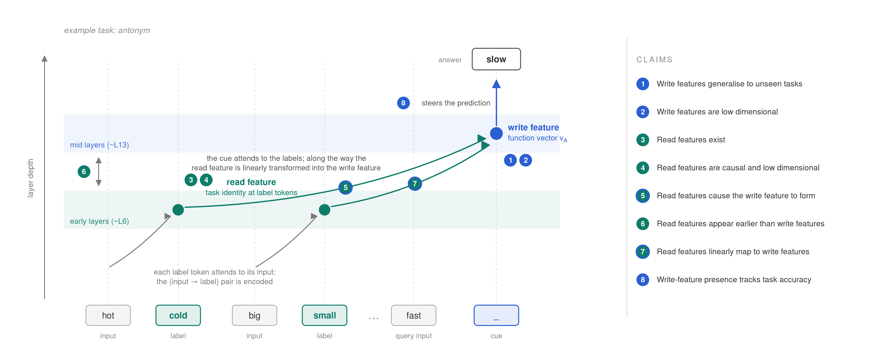

The numbered marks in the figure are the claims of this paper and they form the structure of this paper.

We define the write feature as function vectors from (Todd et al., 2024), who established it's existence and causality - injecting an FV triggers the task on out-of-distribution contexts. We will use function vectors and write features interchangeably in the context of this paper. Claim 1 is a controlled recreation of a result already
shown there. The rest of the claims are to our knowledge novel.

| # | Claim | Headline evidence | Section |
|---|---|---|---|
| 1 | General write features exist at middle layers and are low dimensional per-task | A single vector can steer models to perform the task on zero shot prompts with peak accuracy when injected in middle layers (shown in Todd et al. 2024). The 37 heads selected from train tasks only, can be used to form function vectors for 14 never-seen tasks' accuracy from 0.09 to 0.73 (same as train tasks' accuracy uplift to 0.75). | Claim 1 |
| 2 | Read features exist at early layers | Write features are linearly decodable from single target-token activations at early layers (held-out $R^2$ up to 0.688) | Claim 2 |
| 3 | Read features are causal and low dimensional per-task | We can achieve bidirectional control on task performance using 2 directions per task. Sufficiency: Injecting the shared carrier plus one task-unique direction in dummy prompts recovers 95% of real prompt accuracy (0.596 vs 0.630). Neccesity: ablating one task-unique direction kills ICL (accuracy drops from 0.629 to 0.130) | Claim 3 |
| 4 | Read features are causal for the formation of write features | Label token injection steers the cue representation toward the task's own $v_A$ (cos 0.18 → 0.37) | Claim 4 |
| 5 | Read features appear earlier than write features | Read feature cosine similarity peaks at target tokens, L6 (cos 0.80). Write feature cosine similarity peaks at cue tokens, L13. | Claim 5 |
| 6 | Read features linearly map to write features | Training a linear map on a set of train tasks predicts held-out tasks' mpaping ($R^2 \approx 0.64$). | Claim 6 |
| 7 | Write-feature presence predicts task accuracy | Presence at the cue token and task accuracy rise together (median Spearman ρ +0.96) | Claim 7 |

## The dataset

We study simple ICL tasks, each a single input to output mapping going to and from
words, numbers, or dates, rendered as Q:/A: pairs (e.g. antonym: `Q: unfair` /
`A: fair`). The tasks span six rough families:
translation (english-spanish, german-english, …), morphology (present-past,
plural_to_singular, …), world knowledge (country-capital, person-sport, …), string
operations (capitalize, first_three_letters, …), classification (sentiment, animal_class,
…) and number/date tasks (next_number_digits, iso_date_to_month, …). We consider a universe of ~120 tasks and prune out tasks that the model cannot complete sufficiently well to end up with 69 tasks that we use for the rest of the study. (Completing a task sufficiently well here means that the model can achieve at least 30% accuracy on 10 shot prompts from that task). Worked examples of every prompt structure used in this paper (clean n-shot, zero-shot, mixed-task mixed-target, dummy-target, random-target) are given in Appendix A.

## Claim 1: General write features exist at middle layers and are low dimensional per-task

Following the work of Todd et al. (2024) and Hu et al. (2025), we use sparse optimisation to
select a subset $H$ of attention heads, and form each task's function vector by adding
together those heads' mean activations at the final cue token of 10 shot prompts: $v_A = \sum_{h \in H} h_A$
(as in the Terminology section). Our sparse optimisation selects $|H| = 37$ heads.

The 37-head set is chosen on the 55 train tasks only, yet using that same selection of heads and forming function vectors on held-out tasks still gives an effective steering vector. We show effectivenss of the write feature on 0 shot prompts (e.g. `Q: unfair` /
`A:`) and on 10-shot prompts whose demonstrations come from other tasks to obfuscate the task
(e.g. `Q: 2597` / `A: 2590s`, `Q: Mbale District` / `A: Uganda`, … eight more demonstrations,
each from a different task … `Q: miraculous` / `A:` — the mixed-task, mixed-target structure;
see Appendix A). We can see that under both metrics, the steered performance shows strong uplift in accuracy.

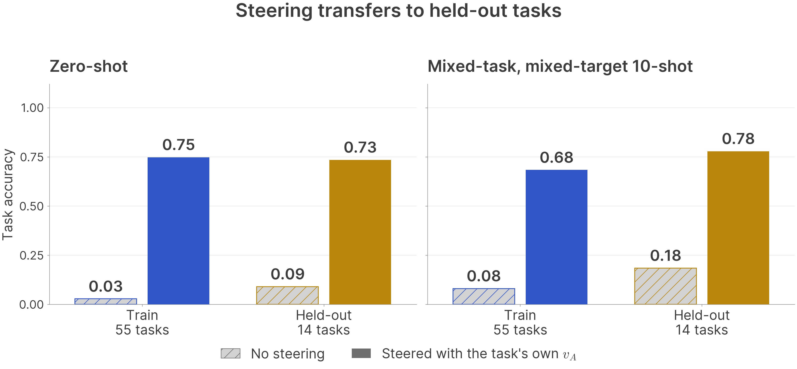
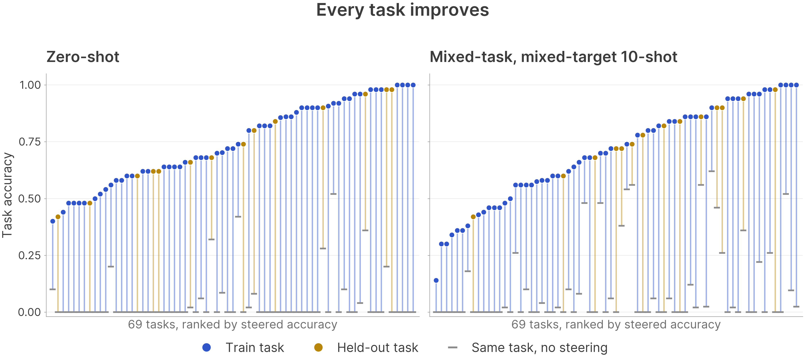

*Steering with the train-selected 37-head write feature transfers to held-out tasks. The
per-task view shows the lift in all tasks.*

## Claim 2: Read features exist at early layers

Next, we want to understand where computations related to the write features might lie. We do this by getting activations for each (token position, layer) in 6 shot prompts and train a (ridge) regression on a train set to predict the write feature for that task (for more details see Appendix D). We can see expected patterns such as the function vector becoming more linearly decodable as you go deeper into the prompt (i.e. after the model has seen more examples of the task), but also at early layers (L5-L10), the target tokens contain more linearly decoadable parts of the write feature than the cue tokens! This suggests there is a computational node prior to the write feature, which we define as the read feature.

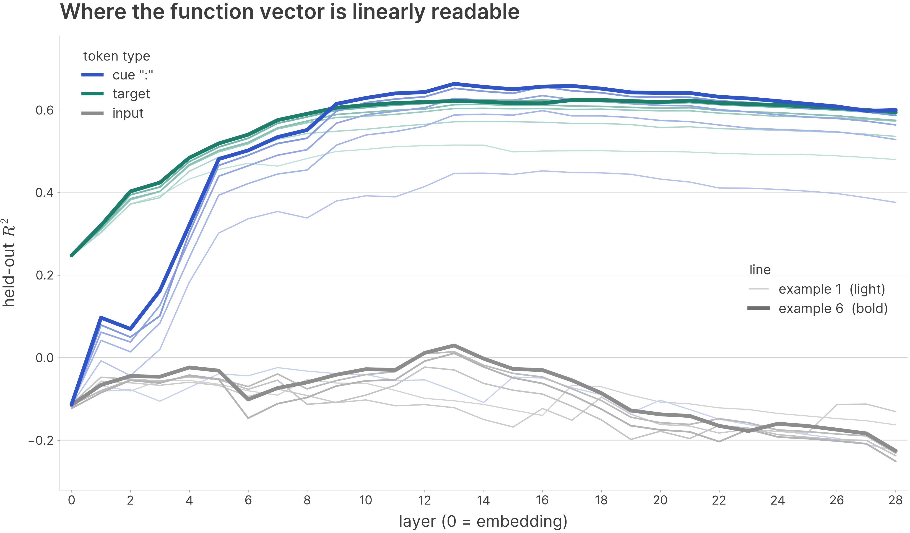

*Labels are informative from early layers and early tokens, the cue catches up example by example. The bold example-6 cue line peaks at L13 ($R^2$ 0.663). The weakest cue line is example 1, where the model has not seen a full example of the task yet. The full token × layer grid is in
Appendix D. Source: `FV_linear_decodability/token_layer_regressions/`.*

(Note: The closest observation in Todd et al. (2024) is attentional: their FV heads primarily
attend to the demonstrations' output (target) tokens (their Figure 3b), but they do not go into detail on the nature of the relationship)

## Claim 3: Read features are causal and low dimensional per-task

We test for read feature candidates that are causal and in this identified region by averaging the activations of the layers at the target token and using it to steer on dummy prompts. Namely: let $t^j_{\mathrm{tgt}}$ be the position of the last token of the final demonstration's target in prompt $p_A^j$. The candidate read feature at layer $\ell$ is the task mean of the residual stream at that position,

$$
m_A(\ell) \;=\; \frac{1}{|\mathcal{P}_A|} \sum_{j} z^{\,t^j_{\mathrm{tgt}}}_{\ell,\, p_A^j},
$$

computed from the 150 clean 10-shot prompts, giving one candidate per layer. To test a candidate causally we steer with it on the dummy-target scaffold (Appendix A): every demonstration target is replaced by a bare `_`, and we add the candidate to the residual stream at each dummy target slot $t$ at its own layer,

$$
z^{\,t}_{\ell} \;\leftarrow\; z^{\,t}_{\ell} + \alpha\, m_A(\ell),
$$

with $\alpha$ the injection strength.

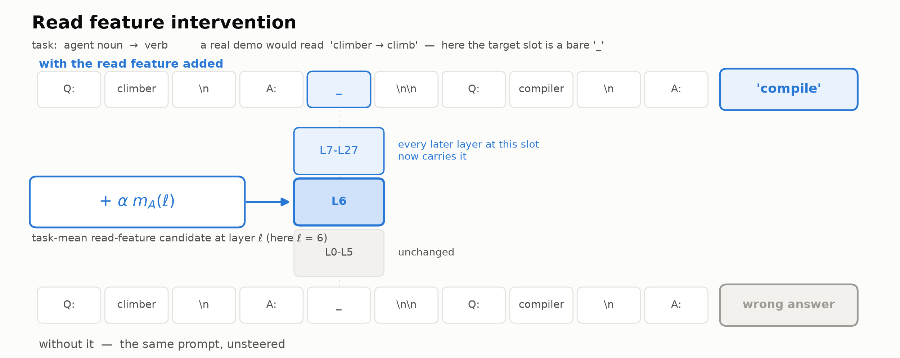

Then we sweep over all layers (and steering strengths for each layer) and see if any layers can steer 1 shot dummy prompts and whether they conincide with the earlier results that we had.

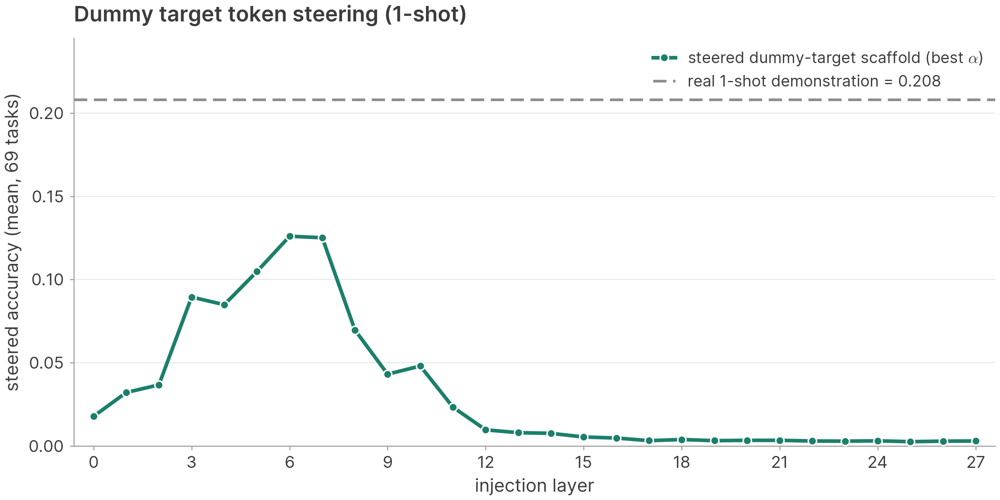

*Steering works only in a narrow early-layer window, peaking at L6 (accuracy of 0.126, L7 essentially
tied at 0.125), coinciding with the early-layer band where the write feature is linearly
readable at target tokens (Claim 2). The dashed line is the mean accuracy of a real
1-shot demonstration (0.208), so the single best-layer injection recovers a majority of real demonstration accuracy.*

There is a peak of steering ability around L5-L7, so we take the mean activations of those
three layers and decompose them. Averaging over the three layers gives one vector per task, $\bar m_A = \tfrac13\sum_{\ell=5}^{7} m_A(\ell)$, and these vectors are very similar across tasks - cosine similarity of 0.73. This suggests that all these activations point along a similar direction, which we call the **shared carrier** $c$, the cross-task mean. We then take each layer's mean activation from L5-L7 for each task and project out the shared carrier and stack the 3 vectors into a matrix and do SVD to extract the top SVD direction,  $v_1$. We define this as the task-unique part.

$$
c \;=\; \frac{1}{|\mathcal{T}|}\sum_{A'} \bar m_{A'}, \qquad
\hat c(\ell) \;=\; \frac{\sum_{A'} m_{A'}(\ell)}{\big\|\sum_{A'} m_{A'}(\ell)\big\|}, \qquad
r_A(\ell) \;=\; m_A(\ell) - \big\langle m_A(\ell),\, \hat c(\ell)\big\rangle\, \hat c(\ell),
$$

$$
v_1 \;=\; \text{top singular direction of } \begin{bmatrix} \hat r_A(5) \\ \hat r_A(6) \\ \hat r_A(7) \end{bmatrix}
\quad (\hat r_A(\ell) = r_A(\ell)/\|r_A(\ell)\|),
$$

where $\hat c(\ell)$ is the **cross-task** carrier direction at layer $\ell$ and the SVD is over a $3 \times
d_{\mathrm{model}}$ matrix with one row per layer.

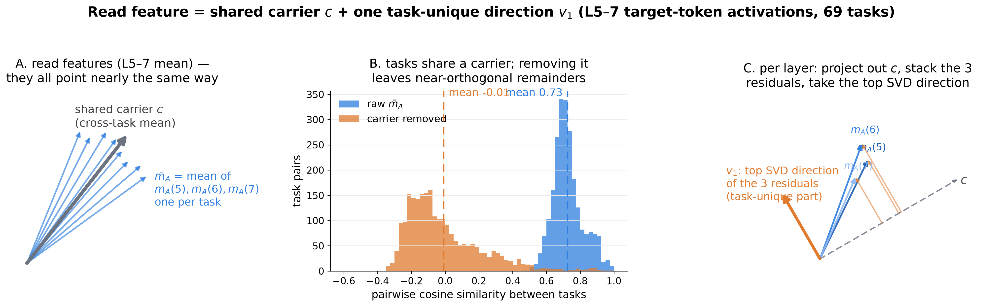

**Necessity:** At every demonstration target token we ablate the projection of the residual stream onto the
task's $v_1$. We find that this collapses 1-shot and 6-shot ICL, while removing a counterfactual
task's $v_1$ leaves accuracy at baseline.

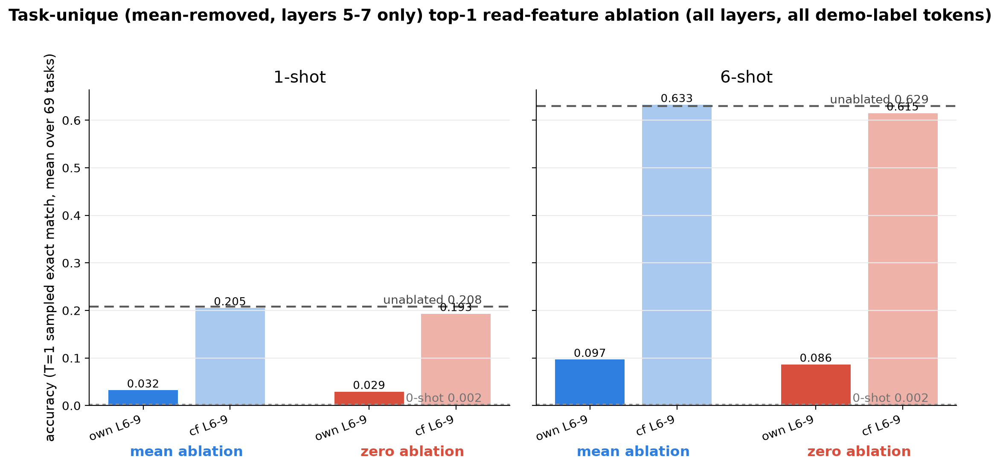

*Ablating one task-unique direction kills the task's own ICL while the counterfactual control
sits at baseline.* 

(Why not simply ablate the raw mean direction $m_A$ itself? That was our
first attempt, but found that the counterfactual control performed equally as well as the specific task - likely because the shared direction contains some relevant computation for general in context learning. The
motivation for the task-unique setup, and the full list of variations we tried are in
Appendix F.

**Sufficiency:** We use 6-shot prompts but replace the target tokens with dummy tokens (same as the 1 shot setting at the start of Claim 3). We then inject the carrier plus the task's single
direction at its natural magnitude, $n_A = \langle \bar m_A - c,, v_1\rangle$ (the natural size of that component in the model's own activations),

$$
u_A \;=\; c + n_A\, v_1,
$$

$u_A$ is what we inject at every dummy target slot. We sweep steering strength $\alpha$ for for each layer we can inject and report the results of the best one. Swept over injection layers on the
1-shot dummy prompts, $u_A$ steers best when injected early (L0–L3 plateau, see Appendix I).
We inject it on 6-shot dummy prompts and find that it recovers 95%
of what a real 6-shot prompt would achieve, which is significantly higher than the unsteered performance.

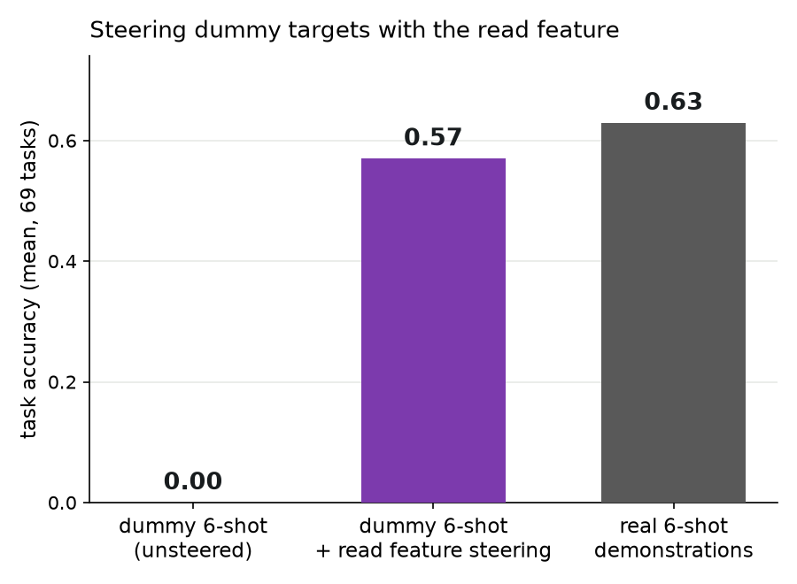

So to recap: 
1. We decompose the mean layer activations into a shared carrier direction and a task unique direction
2. Ablating the task unique direction at the target tokens kills task performance
3. Steering with the combination of the shared carrier direction and the task unique direction can boost task performance.

This shows that by controlling the subspace spanned by the shared carrier direction and the task specific direction, we can acheive bidirectional control - suggesting that this 2D subspace is responsible for the model reading these simple functions in context. We will refer to the acitvations in this 2D subspace as **read features**.

## Claim 4: Read features are causal for the formation of write features

So far, we have shown that the model uses read features and write features to learn tasks, but have not studied the relationship between the two. We go back to the six-shot dummy prompts from the previous section and inject $u_A$ at the target tokens, but instead of measuring the model output, we measure the residual
stream at the final cue token for presence of the write feature (i.e. the task's function vectors). We inject $u_A$ at different strengths, $\alpha$, and observe the change in cosine similarity of the residual stream with the 
increases, the cue-token representation rotates toward the task's own function vector:
cosine at L13 rises from 0.18 to 0.42 between $\alpha=0$ and $\alpha=2$. The rotation is
task-specific — the gain over alignment to a generic all-task FV is positive on 69/69 tasks
(+0.138 at $\alpha=2$) — and it saturates at the same dose that maximises accuracy.

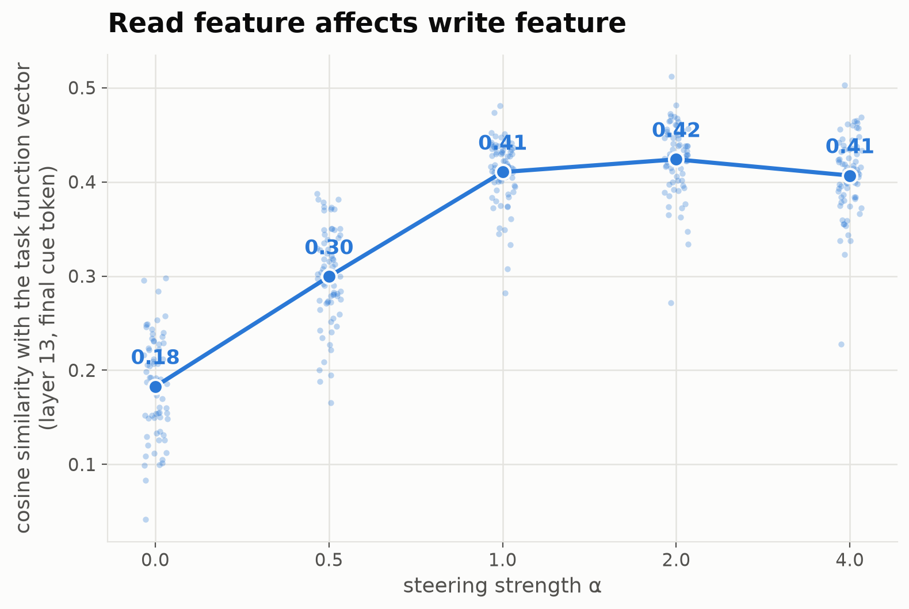

*Cosine between the L13 residual at the final cue token and the task's function vector, as a function of injection strength. Injecting the carrier plus one task-unique direction at the target slots moves the write
site toward the task's function vector. Finer-grained variants (1-shot scaffold, first-slot
only) and the same measurement under the raw $m_A(\mathrm{L6})$ injection are in Appendix I.*

## Claim 5: Read features appear earlier than write features

Presence maps — the mean cosine between the residual stream and each feature, by layer and
token type, over clean 10-shot prompts — separate the two features in both depth and
position. The read feature peaks at demonstration *target* tokens at layer 6 (cos 0.80);
the write feature peaks at *cue* tokens at layer 13 (cos 0.31; 0.35 at the query cue).
Reading happens where target content sits, roughly seven layers before writing happens where
the answer is produced.

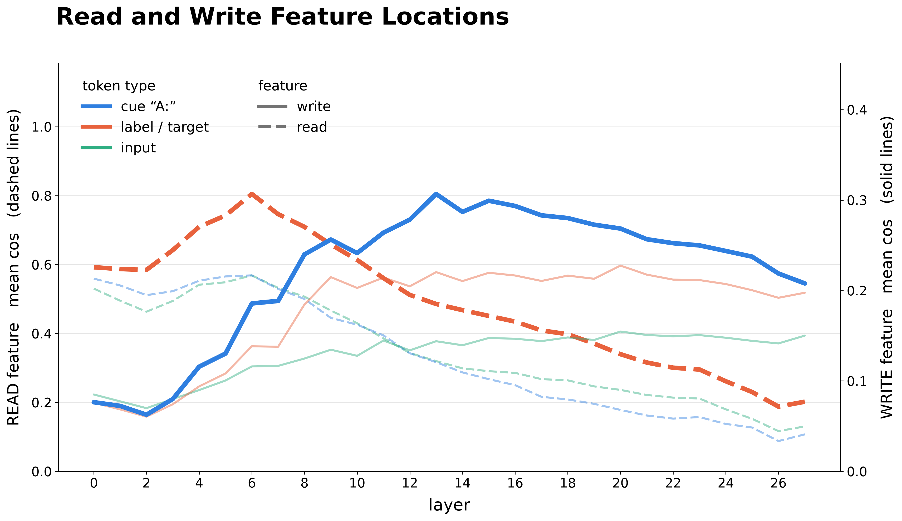

The write-feature side of this picture is consistent with Todd et al. (2024), who find the
causal FV heads clustered in early-middle layers and FV injection effective there (their
Figures 3–4); the read feature, and the read-before-write depth ordering, have no
counterpart in that paper.

## Claim 6: Read features linearly map to write features

A single ridge regression from the mean target-token activation to the per-prompt function
vector, fit on the 55 train tasks, predicts the *held-out* tasks' function vectors with
$R^2 \approx 0.64$ (0.56 per-prompt, 0.63 at task centroids, reading from L12). The map is
one linear transform shared across tasks — it was never shown the held-out tasks' FVs, yet
it places most of them from their read features alone. The sweep covers all 28 layers:
held-out $R^2$ climbs steeply from 0.28 at L0, plateaus from L8, peaks at L12–13, and
declines only gently to 0.53 at the final layer — task identity stays linearly readable at
the target slots through the entire second half of the network.

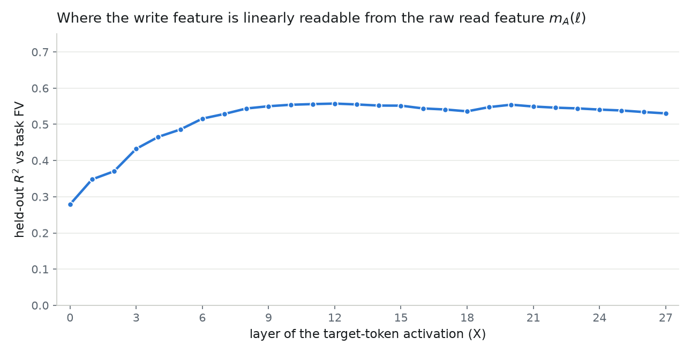

### The read→write map is, to first order, a rotation

What does that linear map actually do? Removing each family's grand mean answers it. The
two task clouds are already the *same shape*: centered pairwise cosines match pair-by-pair
(Pearson 0.93 at L6 / 0.96 at L13, gram-CKA 0.93/0.95), and even the centered norms
correlate (r ≈ 0.79). But they occupy *nearly orthogonal directions* of the residual
stream: the largest principal cosine between the two 90%-variance subspaces is 0.26 (L6) /
0.41 (L13), and each task's read feature is nearly orthogonal to its own FV (matched cos
0.08 / 0.19, vs exactly 0 for mismatched pairs).

Congruent shapes in orthogonal subspaces is precisely the geometry a rotation solves — and
it does: an orthogonal Procrustes map (fit on the 55 train tasks) reaches held-out $R^2$
0.625 vs the unconstrained ridge's 0.657 when reading at L13 — 95% of the ridge. Reading
at L6 additionally needs one global scalar, $s = 1.55$: the task-unique read signal at L6
is only 0.63× FV magnitude (centered norms 30.7 vs 49.1) and grows to parity by L13
(52.1 vs 49.1, $s = 0.93$). In full:

$$\hat v_A = \bar v + s \cdot R\,(m_A - \bar m)$$

— remove the target-token carrier, rigidly rotate the task-identity geometry into the FV
subspace, rescale if reading early, add the generic-FV mean back. The ridge's remaining
~5% is direction-dependent gain (its singular spectrum decays; Appendix J).

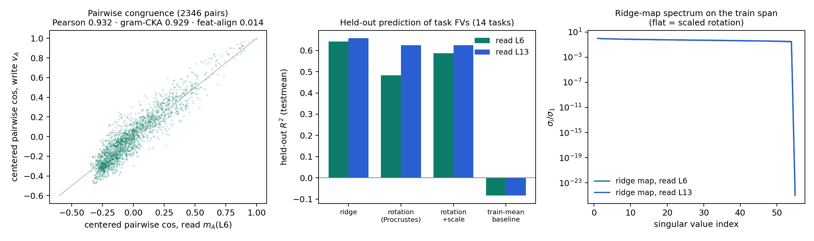

Scope of the claim: with 55 training tasks the map is constrained only on the
≤55-dimensional task-identity span, and it is the *centroid* map (above) — the statement is
that whatever the network computes between target tokens and cue is functionally
equivalent, at task level, to a rigid re-embedding of an unchanged task geometry, not that
the circuitry is literally an orthogonal matrix.

## Claim 7: Write-feature presence predicts task accuracy

Can we predict the model perfomance on these simple tasks before we see the model output using a mechanisitic metric? We find that the strength of the write feature at the query cue can be used to predict performance. 

We define strength of write feature as the cosine similarity of the residual stream with the write feature for that task (mean cosine similarity across layer 9 to 20). We study prompts from n = 0…6 in context demonstrations. We try other variations of measuring cosine similarity in Appendix H and find similar results across the board. We group different presence strengths and plot against model accuracy to get a monotone curve (shown below). Below cos 0.15 the model has 0% accuracy and by the 0.35–0.45 bucket it achieves 50% accuracy. These results are for all tasks grouped together, if we study each task at a time, the spearman coefficient is much higher (~0.95).

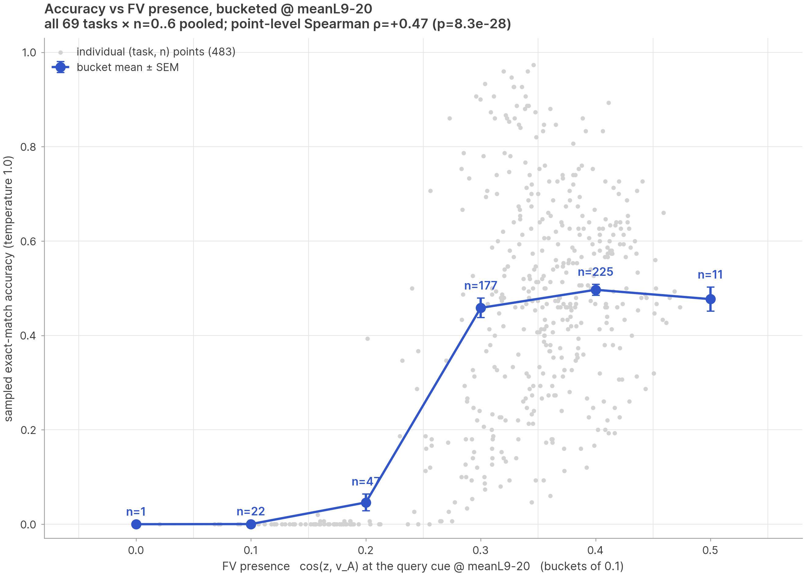

---

# Appendix

## A. Setup & protocol

**Task pool.** 69 tasks survive a 6-shot sampled-accuracy ≥ 0.30 filter of a 117-task
pool (48 tasks fall below threshold). Seed-43 split into 55 train / 14 held-out. Each task
has 150 fixed 10-shot train prompts plus paired test queries.

**Full task list.** *Train (55):* adjective_to_adverb, adjective_to_noun,
agent_noun_to_verb, animal_class, animal_plant_object, antonym, article_choice,
capitalize, capitalize_first_letter, city-country, compound_first, concrete_abstract,
contains_letter_e, country-capital, day_after_textual_date, english-italian,
english-portuguese, english-spanish, first_three_letters, french_noun_gender,
german-english, german_noun_gender, gerund_to_past, hypernym_category, iso_date_to_month,
iso_date_year_plus_one, landmark-country, language_identification, larger_of_pair,
larger_than_1000, lowercase_first_letter, lowercase_word, national_parks,
natural_manmade, next_item, next_month_of_date, next_number_digits,
number_word_to_digits, park-country, person-instrument, person-sport,
plural_to_singular, present-past, prev_number_digits, product-company, sentiment,
singular-plural, singular_or_plural, spanish_noun_gender, starts_with_vowel,
third_person_to_base, titlecase_phrase, us-city-state, verb_tense_label,
verb_to_third_person. *Held-out (14):* ag_news, ends_with_ing, english-french,
first_digit, french-english, gerund_to_base, initials_two_words, past_to_base,
person_place_thing, pos_label, smaller_of_pair, spanish-english, uppercase_word,
word_polarity.

**Head selection.** Pooled sparse optimisation: a gate $c \in [0,1]^{448}$ over all heads,
steering loss on zero-shot prompts summed over the 55 train tasks, + $\lambda\|c\|_1$;
$\lambda = 0.005$ by 5-fold task cross-validation; heads kept at $c > 0.8$ → 37 heads
spanning layers 3–27, densest at 12–15.

**Definitions** (per the project glossary): head vector $\bar h_A$ = mean final-cue-token
output of head $h$ on task $A$'s prompts; function vector $v_A = \sum_{h\in H} \bar h_A$;
per-prompt FV $v^j_A$ = the same sum on a single prompt. The read feature
$m_A(\mathrm{L6})$ is the task-mean block-6 residual at demonstration target tokens.

**Readout.** Temperature-1 sampled generation, exact match against the gold target, seeded
per prompt; steering evaluation reports each task's best injection layer at $\alpha=1$
unless stated otherwise.

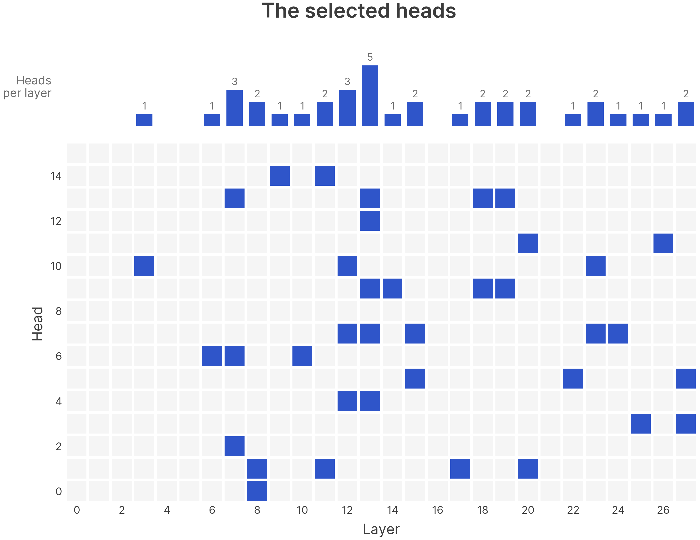

**Prompt structures.** One example of every prompt structure used in this paper (all
examples use the antonym task; every structure ends at the query cue `A:`, where
generation is scored).

*Clean n-shot* — the 150 fixed 10-shot prompts; an n-shot prompt is the same prompt
truncated to its first n demonstrations (zero-shot keeps only the query):

```
Q: unfair
A: fair

Q: anterior
A: posterior

⋮   (8 more demonstrations)

Q: due
A:
```

*Zero-shot* (the steering test bed of Claim 1):

```
Q: miraculous
A:
```

*Mixed-task, mixed-target 10-shot* (Claim 1 test setting) — each demonstration is drawn
from a *different* task with its own correct target (here: year_to_decade,
landmark-country, spanish-english, …); the pairs are internally correct but only the
query belongs to the evaluated task, so the context provides format but no task
identity:

```
Q: 2597
A: 2590s

Q: Mbale District
A: Uganda

⋮   (8 more demonstrations, each from another task)

Q: miraculous
A:
```

*Dummy-target scaffold* (read-feature sufficiency, Claim 3) — the task's own inputs, but
every target is replaced by a bare `_`, so the prompt teaches nothing (unsteered accuracy
0.000); the read feature is injected at the `_` slots:

```
Q: unfair
A: _

Q: anterior
A: _

⋮   (6 demonstrations in total)

Q: due
A:
```

*Random-target scaffold* (scaffold-robustness control, Appendix E/I) — as the dummy
scaffold, but each `_` is replaced by a real word sampled from *other* tasks' output
pools (illustrative targets shown), so the targets are actively wrong rather than empty:

```
Q: unfair
A: piano

Q: anterior
A: Uganda

⋮   (6 demonstrations in total)

Q: due
A:
```

## Write features are low dimensional

**Across the pool: a 22-dimensional subspace carries most of the steering.** The top 22
uncentered PCs of the 69 task-mean function vectors (90% of their energy) define one fixed
subspace. Projecting each task's $v_A$ into it and rescaling the strength per task
($\alpha$ up to 2, since projection shrinks the norm) recovers zero-shot steering of 0.68
on both train and held-out tasks, against 0.75 / 0.73 for the full 4096-dimensional
vectors — and the train/held-out gap vanishes entirely.

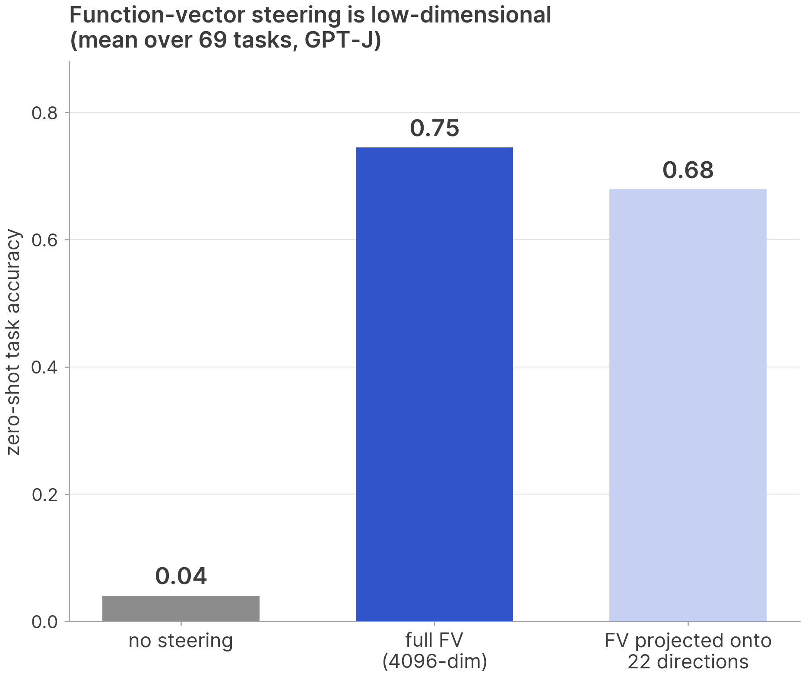

**Per task: a single direction, with bidirectional control.** For an individual task the
write feature is effectively rank one. The same unit direction $\hat v_A$ that steers
zero-shot prompts (sufficiency) is also necessary: zero-projecting it out of the residual
stream at just the final cue token collapses 6-shot ICL from 0.639 to 0.013 — the
zero-shot floor. The kill is task-specific: ablating a counterfactual task's direction
costs only 0.16, and mean-ablation (which keeps the generic cue-token content) shows the
same own-vs-counterfactual gap (0.242 vs 0.616). The same holds on 1-shot prompts
(baseline 0.211): own-FV zero-ablation lands on the floor (0.001) while the counterfactual
direction leaves 0.107 and counterfactual mean-ablation leaves the baseline intact (0.205).

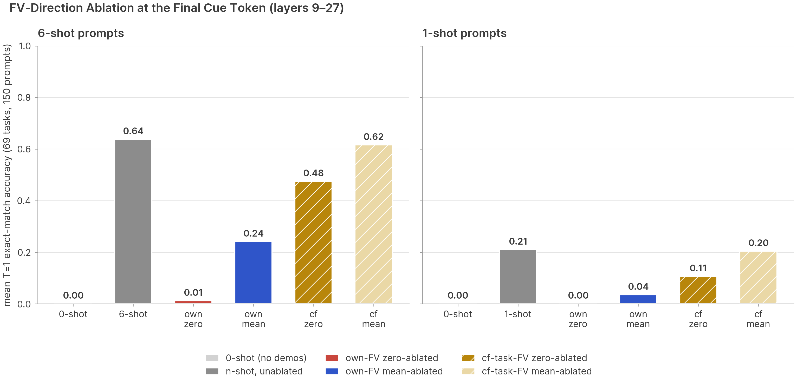

*Removing one direction at one token position destroys ICL — at 6 shots and at 1 shot —
only for the task that owns the direction (layer clamp 9–27). Source: `FV_ablation/`.*

**Relation to Todd et al. (2024).** Both results in this section are novel. That paper
establishes sufficiency only — adding an FV triggers the task — and does not study the
geometry of the FV set (its closest analysis is decoding single FVs to vocabulary, §3.2
there) or test whether the model's own ICL *depends* on the FV direction. The shared
22-dimensional steering subspace and the necessity result (own-direction ablation kills
natural ICL, task-specifically and bidirectionally) have no counterpart there.

## B. Write-feature dimensionality in detail

**Spectra.** The 55 train task-mean FVs need 24 PCs for 90% of centered variance; the
pooled per-prompt stack (8,250 × 4096) has stable rank 3.0 raw / 5.7 centered.

**Why the basis must see every task.** A sparse PC selection fit on the *train* tasks'
per-prompt basis (46 PCs) keeps train steering but collapses held-out tasks (0.46 vs
0.73): held-out FVs stick partly out of the train span, and the drop tracks the lost
energy (Spearman 0.84). Projecting onto the entire 512-PC train dictionary recovers most
of it (0.68), so the failure is the train-only *selection*, not the dictionary. Rebuilding
the basis and selection on all 69 tasks gives 50 PCs that match the full FV everywhere
(held-out 0.733 vs 0.734); an L13 rerun reproduces the selection (47/48 shared PCs), so
the injection-layer choice is not load-bearing.

**The 22D result in context.** Plain truncation to the top-22 task-mean PCs fails at
$\alpha=1$ (0.59 / 0.60) mostly through norm shrinkage; per-task $\alpha$-rescaling
recovers to 0.68 / 0.68. The residual gap to the full FV is direction loss concentrated in
a few low-coverage tasks (country-capital stays ≤ 0.02 at every $\alpha$; the translation
family moves little) — variance-ranked PCs are not exactly the steering-relevant ones, a
pattern seen in four independent analyses in this project.

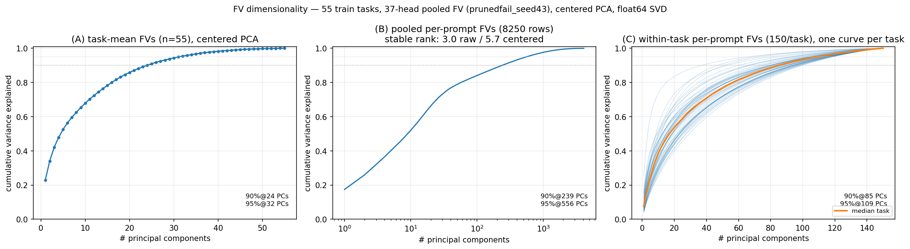
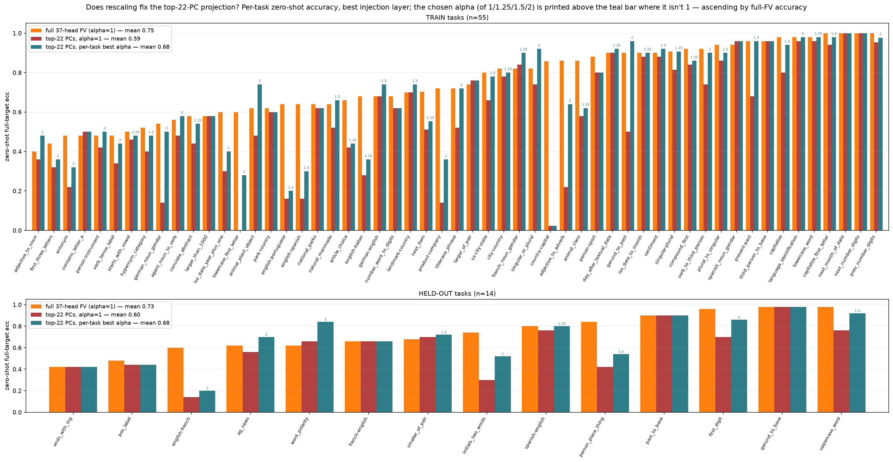

## C. Write-feature ablation in detail

Conditions: {zero-projection, mean-ablation} × {own $\hat v_A$, counterfactual task's
direction} × layer clamps {blocks 9–27, 0–27}, applied at the final query cue token only,
on 150 fixed 6-shot prompts per task. The two layer clamps are indistinguishable
everywhere, so the main text quotes the 9–27 numbers. The mean reference is the
equal-task-weighted grand mean of cue-token residuals; counterfactual pairs are drawn from
different semantic families.

| Condition (6-shot) | Mean acc (69 tasks) | Drop vs 6-shot |
|---|---:|---:|
| Real 6-shot baseline | 0.639 | — |
| Own FV, zero-projection | 0.013 | −0.626 |
| Counterfactual FV, zero-projection | 0.476 | −0.163 |
| Own FV, mean-ablation | 0.242 | −0.397 |
| Counterfactual FV, mean-ablation | 0.616 | −0.023 |
| Zero-shot floor | 0.002 | −0.637 |

**1-shot prompts** (same 150 queries with only the first demonstration, layer clamp 9–27):

| Condition (1-shot) | Mean acc (69 tasks) | Drop vs 1-shot |
|---|---:|---:|
| Real 1-shot baseline | 0.211 | — |
| Own FV, zero-projection | 0.001 | −0.210 |
| Counterfactual FV, zero-projection | 0.107 | −0.104 |
| Own FV, mean-ablation | 0.036 | −0.175 |
| Counterfactual FV, mean-ablation | 0.205 | −0.006 |
| Zero-shot floor | 0.002 | −0.209 |

At 1 shot no task keeps more than 0.02 under own-direction zero-ablation (train 0.001 /
held-out 0.001). The counterfactual zero-ablation control is relatively costlier than at 6
shots (−49% vs −26% of baseline): the tasks where the counterfactual direction also kills
1-shot ICL (e.g. spanish-english, gerund_to_base, plural_to_singular) are those whose own
and counterfactual directions are most similar (cos 0.54–0.79). Counterfactual
mean-ablation stays at baseline, so the damage is specific to the projected-out direction.
No train/held-out gap at 6 shots either (own-zero 0.014 / 0.005). Rare partial survivors
are date/number tasks (day_after_textual_date 0.35–0.41; iso_date_to_month ≈0.08;
next/prev_number_digits ≈0.1), where 6-shot context appears to route around the cue-token
direction.

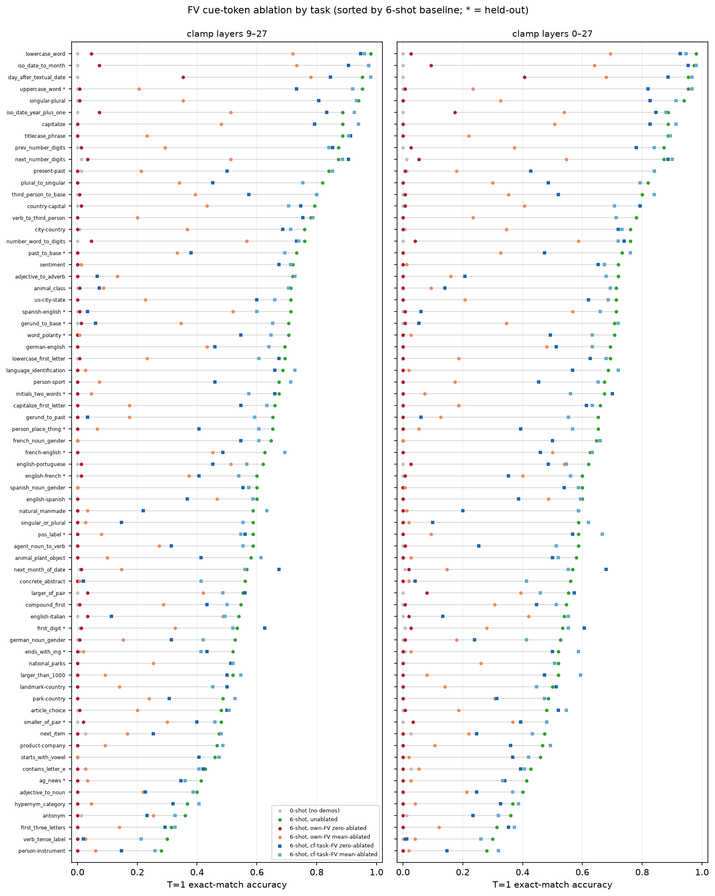

## D. Decodability grid in detail

868 cells: 31 token positions (per demo: pre-target ":", first and last target token; plus
the query cue) × 28 layers, later extended with 21 input-side positions and an
embedding-only baseline (X = the token embedding; GPT-J has no absolute position
embeddings, so this is the exact pre-attention input). Each cell is a full-dimensional
ridge ($\lambda$ by 5-fold CV over train tasks) from the activation to the per-prompt FV,
scored against the task FV on the 14 held-out tasks.

**Regression design: train on per-prompt FVs, evaluate on task FVs.** Each cell's ridge
is fit with one row per (task, prompt) — X = that single position's residual activation,
Y = that prompt's *per-prompt* function vector $v^j_A$ — giving 55 tasks × 150 prompts =
8,250 training rows. Fitting task-level targets directly would leave 55 samples for a
4096 → 4096 linear map, a massively over-specified problem that a ridge can satisfy
without learning anything transferable. The per-prompt targets both multiply the sample
count 150-fold and scatter around each task's mean; that within-task spread is largely
unpredictable from a single token activation, so it acts as target noise that discourages
the fit from chasing prompt-specific detail rather than the task-level signal. Evaluation
then scores what we actually care about: predictions on the 14 held-out tasks are
compared to the *task* FV $v_A$ (the per-prompt mean), per task, with the held-out pool's
mean FV as the reference in the $R^2$ denominator — so a cell scores highly only if the
activation places unseen tasks' write features correctly, not if it reproduces per-prompt
jitter. Consistent with this, decomposing the related target-token map (Appendix G) shows
between-task centroid placement carries ~0.65 of the $R^2$ while within-task deviations
contribute only ≈0.03–0.05: the transferable signal is the task centroid, and evaluating
against it measures exactly that.

- Peak cell: L15, demo-10 pre-target, held-out $R^2$ 0.688; the whole top-15 is pre-target
  positions of demos 7–10 at L12–L17.
- By layer: steep rise L0 → L8 (0.22 → 0.56), plateau L12–L16 (~0.58), slow decay.
- Train-side $R^2$ is 0.93–0.96 in the bright band — a ~0.27 generalisation gap, i.e. the
  maps are partly task-specific (see G).
- Sawtooth: at L6 the cue trails its own demo's target by ~0.48 $R^2$ at example 1,
  converges by example 5–6, and inverts by example 10.
- Embedding baseline: target tokens 0.245 (token identity alone carries a share of the
  early-layer signal); cue and input positions are at or below zero.

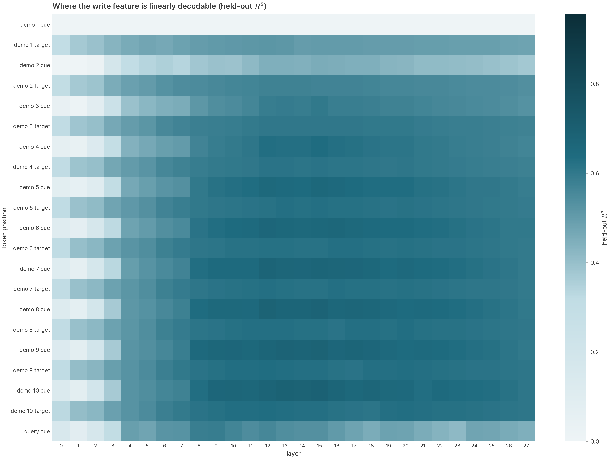

*The full token × layer grid behind the Claim 2 line figure. The bright band is the
pre-target and target positions of later demos at layers ~8–17.*

## E. Read-feature steering in detail

**Where to inject (why L6).** The layer choice comes from a 28-layer sweep on the 1-shot
dummy-slot scaffold ($\alpha \in \{0.5, 1, 2, 4\}$, best per layer, mean taken at the same
layer as the injection): accuracy climbs from 0.018 at L0 to the 0.126 peak at L6 (L7
essentially tied at 0.125), then falls off a cliff — 0.070 at L8, 0.010 at L12, and the
~0.003 unsteered floor from L13 onward. Held-out tasks peak at the same place. The
per-task view shows this is not an averaging artifact: nearly every task that steers at
all has its hot band inside L3–L10, and no task responds late.

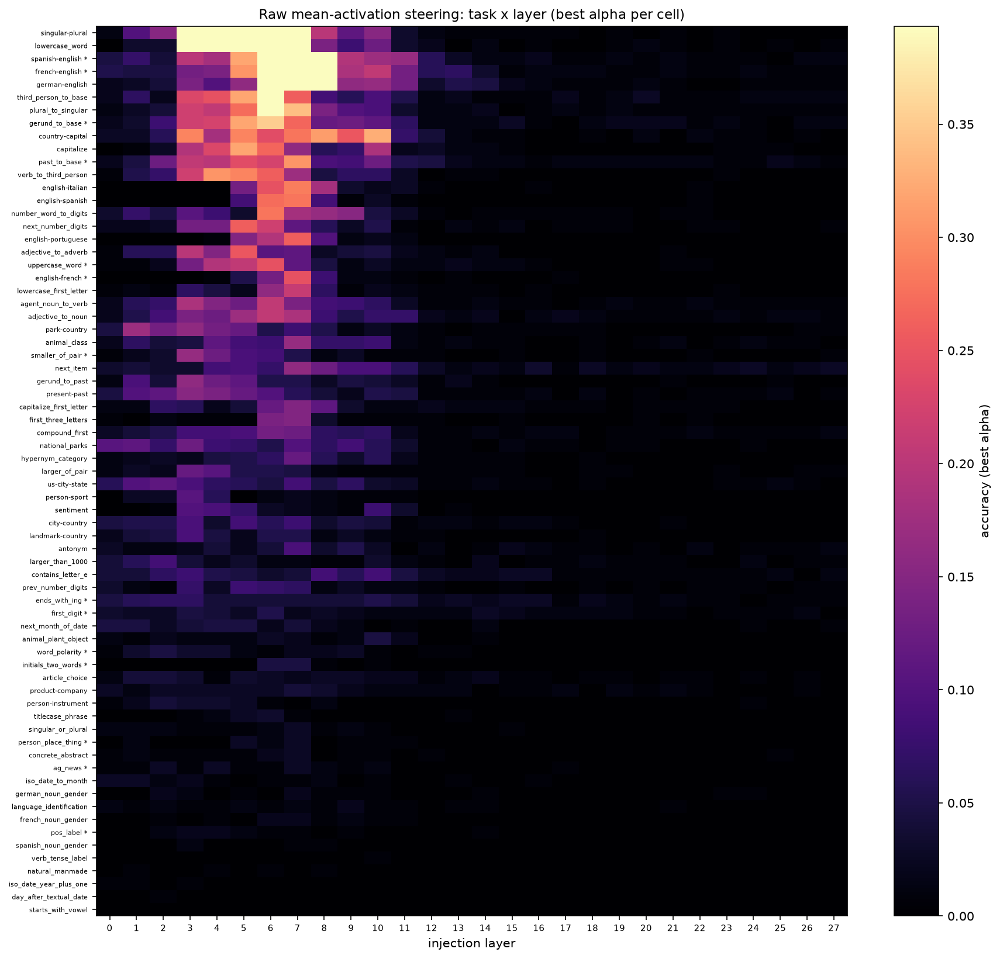

**Which vector steers.** On the 1-shot dummy-slot scaffold, the raw task mean beats every
engineered alternative: raw mean @L7 0.121 > mean-difference (task mean − shared mean)
0.082 > sparse-selected target-slot head sum 0.050. The shared-mean control alone is flat
(≤0.013 at every layer), so the shared component is not what steers — but differencing it
out still hurts, suggesting task-correlated structure is removed with it.

**Dose and slots.** The 1-shot injection peaks at $\alpha=2$; six slots peak at $\alpha=4$
and have not saturated (0.381 → 0.442 from $\alpha=2$ to 4). Held-out tasks steer slightly
better than train (0.49 vs 0.44) — expected, since the vector is a per-task mean with
nothing fit. 17/69 tasks match or beat real 6-shot demos; the best are string/format tasks
at near-ceiling.

**Scaffold robustness.** The dummy `_` target is not load-bearing: on a scaffold whose six
demo targets are real words sampled from *other* tasks' output pools, full-mean steering
reaches 0.494 (vs 0.447 on underscores) — the injection overrides actively wrong target
content, not just empty slots. Source:
`bottom_up_read_features/steering_results/sixshot_randomlabel/`.

**No low-dimensional shortcut (across tasks).** Restricting the steering vector to top-k
centered PCs of the 69 task means retains accuracy roughly linearly in k with no knee:
k=40 (95% of between-task variance) keeps only 76% of the full effect. The between-task
variance basis is not the basis the model reads.

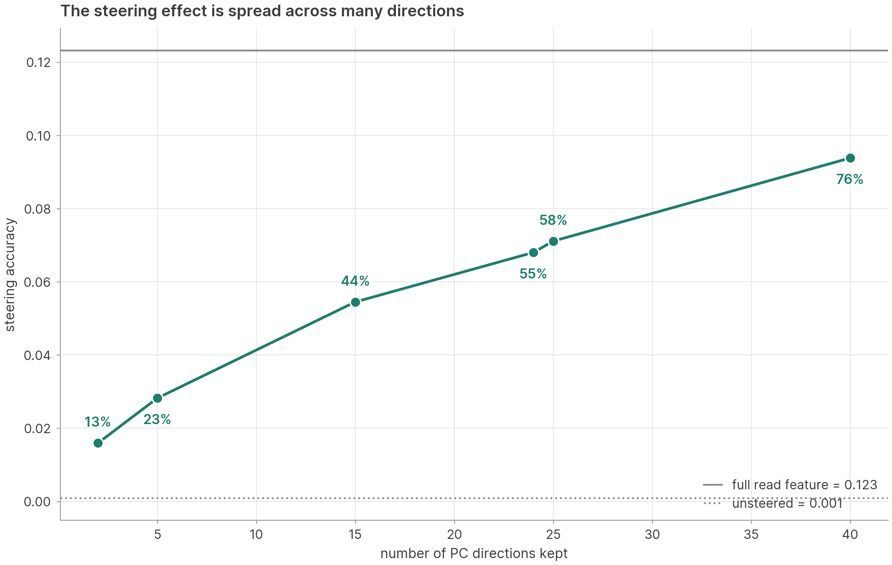

## F. Read-feature ablation in detail: the rank/band ladder

**Why ablating the raw mean direction fails (motivation for the task-unique setup).** The
natural first attempt is to zero-project the task's own unit read-feature direction
$\hat m_A(\mathrm{L6})$ at the target tokens. This kills ICL (own 0.009 from a 0.629
baseline) — but the counterfactual control fails: zero-projecting a *different* task's
direction also collapses accuracy (0.278), so the kill cannot be attributed to task
identity. The reason is structural: read features are far more similar across tasks than
function vectors are (mean pairwise cosine 0.727 vs 0.393; figure below), so any task's
raw direction contains mostly the shared carrier, and removing it removes the same
load-bearing shared component regardless of which task the direction came from. This is
what forced the decomposition $m_A = \bar m + u_A$ used in Claim 3: ablate only the
task-unique part and the counterfactual control lands exactly at baseline.

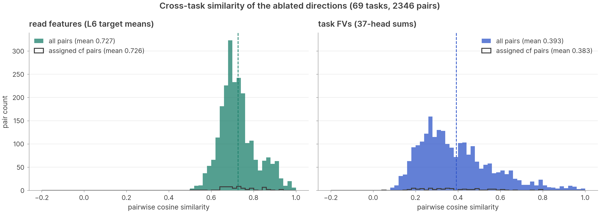

Design: ablate a per-task subspace at *every demo target token, every layer's block input*;
mean mode moves the projection to the cross-task grand mean (specificity-clean), zero mode
removes it. Baselines share the exact prompt bank and seeding with the steering runs.
Bases, in the order they were tried: the fixed unit L6 read-feature direction (rank-1);
the task's top-5 uncentered per-prompt read-feature PCs (rank-5); the same after centering
(centered-5); and the **task-unique** family — take the 11 layer-wise task-level read
features (L5–15), remove each layer's cross-task mean direction, and orthonormalize the
residuals (effective rank ≈ 1.4; max |cos| to any layer-mean direction: median 0.09 —
near carrier-free). Top-3 / top-1 = SVD compressions of that basis; L6–9 = the
band-restricted variant.

| Basis (6-shot, baseline 0.629) | Own, mean-abl | Cf, mean-abl | Own, zero | Cf, zero |
|---|---:|---:|---:|---:|
| Rank-1 (unit L6 read dir) | 0.567 | 0.623 | 0.009 | 0.278 |
| Rank-5 (uncentered PCs) | 0.503 | 0.620 | 0.004 | 0.222 |
| Centered-5 PCs | 0.545 | 0.625 | 0.393 | 0.550 |
| Task-unique 11-dir (L5–15) | 0.095 | 0.629 | 0.080 | 0.604 |
| — top-3 SVD | 0.099 | 0.629 | 0.089 | 0.608 |
| — top-1 direction | 0.146 | 0.630 | 0.145 | 0.611 |
| — top-3, L6–9 band only | 0.135 | 0.630 | 0.127 | 0.611 |
| **— top-1, L5–7 band only (main-text object)** | **0.130** | **0.632** | 0.119 | 0.614 |
| Attention-mask control | 0.046 | | | |

Readings: (1) uncentered bases can't separate own from counterfactual in zero mode because
read features overlap heavily across tasks (cos ≈ 0.73 vs 0.39 for FVs) — the shared
carrier is load-bearing but non-specific; centering fixes the zero-mode collateral (cf
0.278 → 0.550) but the within-task variance PCs are a weak proxy for identity (own only
0.393). (2) The between-task mean differential — the task-unique basis — is the target-side
task-identity code: near-total own-task kill with the counterfactual control *exactly* at
baseline, in both modes (the basis is orthogonal to the carrier, so mean and zero
coincide). It is the first and only variant with 1-shot specificity too (own 0.035 vs cf
0.202, baseline 0.208). (3) Partial survivors of own-task ablation (>30% of baseline) are
echo/copy-heavy tasks (lowercase_word, larger/smaller_of_pair, several X-english
translations). (4) Masking the final cue's attention to demo target positions collapses
accuracy to 0.046 — target-token attention is the near-exclusive route for task information
into the query.

## G. The read → write linear map in detail

*(Convention note: the detailed numbers in this appendix were computed with the ten-site
average of the demonstration target activations as the per-prompt X — the estimator
variant of Appendix K — and have not been re-run under the final-target-site convention;
the main-text Claim 6 numbers and figure use the final-target-site X.)*

**What transfers is the centroid map.** Against per-prompt FV targets the held-out $R^2$
is 0.44–0.50 over L5–L15; the full 28-layer sweep spans 0.26 (L0) to the 0.498 peak (L13)
and still holds 0.46 at L27. Decomposing it, between-task centroid placement carries 0.65
while within-task deviations contribute ≈0.03 — and a held-out-prompt check on train tasks
confirms the within-task share is ≈0.05 even in-distribution. The map is a task-centroid
interpolator; scored against task FVs (the centroid target) it reaches the ~0.7 quoted in
the main text.

**Robustness.** Over 10 random 55/14 splits: held-out $R^2$ 0.469 ± 0.040 (canonical split
at the mean); the oracle ceiling (leave-one-out task-mean predictor) is 0.675. Transfer is
bimodal: morphology/translation tasks sit essentially at their oracle, while
classification-like tasks (pos_label, ag_news, uppercase_word, initials_two_words,
first_digit, person_place_thing) stay near zero under *every* split — their read→write
relation is task-idiosyncratic, not merely under-covered. Neither PCA-90 rank reduction
nor lasso in the PCA basis beats the plain full-dimensional ridge.

**Task-level fit agrees.** Treating each task as one sample (55 train centroids → task FV,
LOO-CV $\lambda$) reproduces the per-prompt sweep where they overlap (held-out $R^2$ 0.683
vs 0.692 at L13, train-mean convention) — consistent with the centroid-memorization
reading: the 55 task centroids already carry all the transferable signal. Despite
n=55 << d=4096, LOO-CV picks the smallest $\lambda$ from L6 on (min-norm interpolation
generalizes; explicit shrinkage hurts). Source: `read_write_relationship/linear_mapping/`.

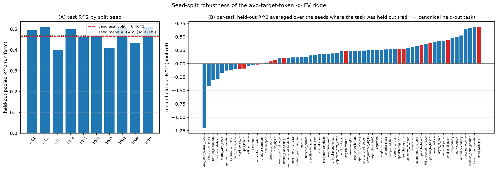

## H. Presence-vs-accuracy method

For each task and n ∈ 0…6, the 150 fixed 10-shot prompts are truncated to their first n
demonstrations (paired queries throughout). Presence = mean cos between the residual
stream at the query cue and the unit $\hat v_A$, averaged over layers 9–20 (per-layer and
max-over-band variants behave the same); accuracy = the standard temperature-1 sampled
exact match on the same prompts. One point per task per shot count (483 points); the
within-task statistic pairs each task's presence and accuracy across its own seven shot
counts.

**Layer-choice robustness (no cherry-picking).** The headline within-task statistic is
insensitive to where presence is read: every single layer L9–L20, the max over the band,
and the band mean give the *identical* median within-task Spearman ρ = +0.964, positive
in 69/69 tasks — with seven near-monotone points per task, the within-task ranking is the
same at every layer, so the rank correlation saturates. Where the variants do differ is
the pooled point-level correlation over all 483 (task, n) points, which mixes in the
negative between-task relation discussed below:

| Presence variant | Median within-task ρ | Positive tasks | Pooled point-level ρ |
|---|---:|---:|---:|
| L9 | +0.964 | 69/69 | 0.629 |
| L10 | +0.964 | 69/69 | 0.573 |
| L11 | +0.964 | 69/69 | 0.599 |
| L12 | +0.964 | 69/69 | 0.559 |
| L13 | +0.964 | 69/69 | 0.524 |
| L14 | +0.964 | 69/69 | 0.458 |
| L15 | +0.964 | 69/69 | 0.519 |
| L16 | +0.964 | 69/69 | 0.424 |
| L17 | +0.964 | 69/69 | 0.396 |
| L18 | +0.964 | 69/69 | 0.343 |
| L19 | +0.964 | 69/69 | 0.295 |
| L20 | +0.964 | 69/69 | 0.298 |
| max over L9–20 | +0.964 | 69/69 | 0.533 |
| **mean over L9–20 (main text)** | **+0.964** | **69/69** | **0.469** |

Single early layers give somewhat higher pooled values (L9: 0.629) purely through the
between-task component; since the claim is the within-task relationship, the band mean is
reported in the main text as the assumption-free default rather than any per-layer
optimum. Source: `write_feature_and_model_accuracy/correlation_summary.csv` (pooled) and
the per-task recomputation over `presence_vs_acc/<task>.npz` (within-task).

**What the within-task correlation looks like.** Per-task values are tight: minimum
0.643, 25th percentile already at 0.964, maximum 1.000 (per-task list in
`diagnostics_per_task.csv`). Three illustrative tasks — the perfect case, the median
case, and the single worst case in the pool:

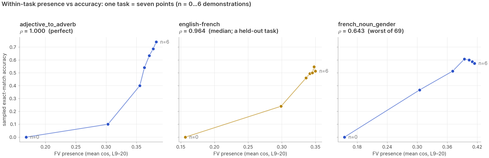

*One task = seven (presence, accuracy) points, n = 0…6. Even the worst task
(french_noun_gender, ρ = 0.643) is strongly positive — its rank violations are confined
to the saturated top of its curve, where accuracy plateaus while presence still creeps
up.*

**Between-task, the sign flips** (Simpson's pattern): at fixed n ≥ 2, tasks with higher
presence tend to score *lower* (ρ ≈ −0.3 to −0.4 at n = 3…6), even though every task
individually moves up with n. Diagnostics: a shared-mean control (cos to the grand-mean
FV) does not explain it — the partial correlation is unchanged; a-priori task features
(target token count, output entropy, output-pool size) correlate with presence
(ρ ≈ −0.44…−0.54) and weaken the negative relation but do not remove it (partial
ρ ≈ −0.21…−0.26). Subtracting each task's generic-FV alignment (presence minus
cos-to-grand-mean, L13) strengthens the between-task negativity (ρ −0.39 at n=6), while
alignment to the grand-mean FV itself relates *positively* pooled (ρ 0.54) — the
between-task sign is a property of the task-specific component. Per-prompt granularity
(72,450 generations): pooled point-biserial r = 0.36 (L13), driven by the shot-count
sweep; within a fixed n it is ≈ 0. Sources:
`write_feature_and_model_accuracy/{diagnostics.txt, per_prompt/, baseline_subtracted/}`.

## I. Task-unique steering & the carrier-gap hypothesis tests

*(Convention note: the mean-free and swap headline numbers here use the final-target-site
read feature; the carrier-gap hypothesis tests — random-word scaffold, attention capture,
error anatomy — were run with the ten-site-average swap direction (Appendix K) and have
not been re-run.)*

**Sufficiency with the raw read feature $m_A(\mathrm{L6})$ (the original test).** Before the
decomposition, the causal test injected $\alpha \cdot m_A(\mathrm{L6})$ — the full task mean
at the best layer of the 1-shot sweep — at the dummy target slots. L6 is selected by a full
injection-layer sweep (all 28 layers, 1-shot scaffold, best $\alpha$ per layer): steering
works only in a narrow early-layer window, peaking at L6 (0.126, with L7 at 0.125),
collapsing to 0.010 by L12 and to the ~0.003 floor everywhere later; a task-agnostic
shared-mean control never exceeds 0.013 at any layer. With six dummy slots steered at
$\alpha = 4$ the model recovers 70% of what six real demonstrations deliver
(0.000 → 0.442 vs the 0.630 real 6-shot reference).

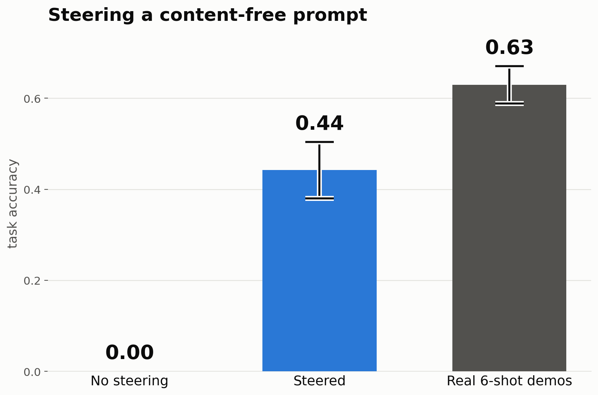

**Effect on the write site under the raw $m_A(\mathrm{L6})$ injection.** With
$\alpha \cdot m_A(\mathrm{L6})$ at all six dummy slots (the original sufficiency test above),
the cue-token cosine to the task's own FV at L13 rises from 0.18 to 0.37 between $\alpha=0$
and $\alpha=2$; the task-specific gain over the generic all-task FV is positive on 69/69
tasks (+0.093 at $\alpha=2$) and still rising at $\alpha=4$. Two finer-grained variants
agree. On the 1-shot scaffold the same rotation appears at half strength ($\Delta\cos$ to
own $v_A$ +0.088 at $\alpha=2$, vs +0.044 to the generic FV). And steering *only the first*
target slot shows the effect propagating forward with decay: the task-specific excess
alignment is largest at the very next cue (+0.047 at $\alpha=2$) and falls monotonically to
+0.010 by the query cue — each demonstration's target refreshes a signal that would otherwise
fade. Sources: `read_write_relationship/{bottom_up, bottom_up_1shot, bottom_up_firstlabel}/`.
Under the main-text $u_A$ injection the rotation is larger (0.18 → 0.42; task-specific
excess +0.138 at $\alpha=2$); its 1-shot variant shows the same rotation at half strength ($\Delta\cos$ to own $v_A$ +0.121 at $\alpha=2$, vs +0.051 to the generic FV; task-specific excess positive on 68/69 tasks); `read_write_relationship/ctop1_1shot/`.

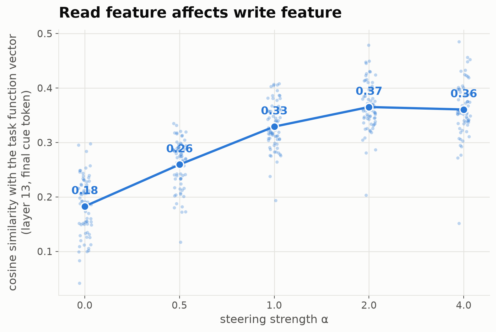

**Read-feature steering variants (6-shot dummy-target scaffold, 69-task means).** The
main text reports the carrier + one-direction vector $u_A$; the other vectors built from
the read feature, all on the same scaffold and readout:

| Steering vector | injected at | best acc |
|---|---|---:|
| Full read feature $m_A(\mathrm{L6})$ | L6 | 0.447 |
| Mean-free part $m_A - \bar m$ | L6 | 0.339 |
| Shared carrier alone | any | ≤ 0.013 |
| Single-direction swap $\alpha\, s_1 v_1$ (removes natural component first) | L6 | 0.327 |
| $w_A$ = task's own L6/7 mean + $n_A v_1$ (doubles the $v_1$ component) | L1 | 0.583 |
| **$u_A$ = carrier $c$ + $n_A v_1$ (main text)** | L0 | **0.596** |
| Real 6-shot demonstrations | — | 0.630 |

The two composites ($w_A$, $u_A$) were located by a 1-shot injection-layer sweep (all 28
layers, $\alpha \in \{0.5,1,2,4\}$, per-task best $\alpha$): both sit on an L0–L3 plateau
(0.220 and 0.195 respectively; the matched-site raw mean $m_A(\ell)$ peaks at 0.126 at L6)
and are dead from L12. $u_A$ is the shorter vector (‖$u_A$‖ ≈ 55 vs ≈ 79) and prefers
$\alpha = 2$; $w_A$ additionally carries the task's residual unique directions and twice the
$v_1$ component, which helps on a single slot (+0.025 at 1 shot) but not at six. Not yet
run: the full mean injected at L0/L1 (to separate the injection-layer effect from the
vector composition) and $c + 2 n_A v_1$ (to match $w_A$'s $v_1$ dose).

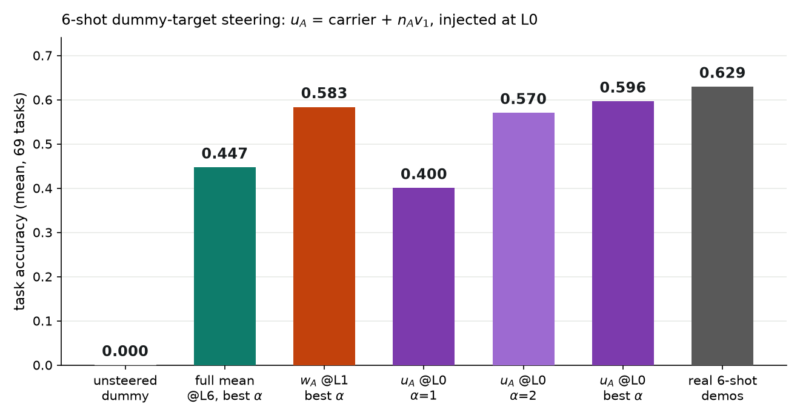

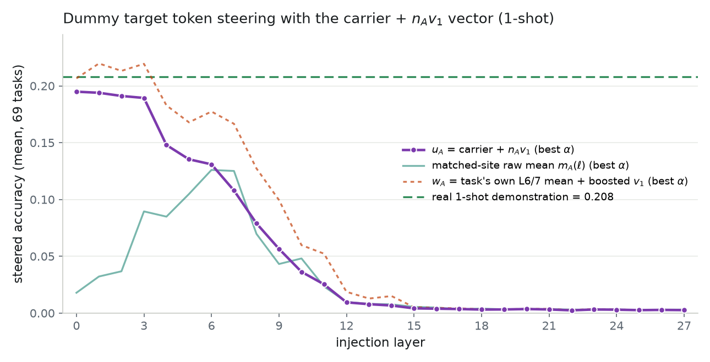

**The carrier gap.** The task-unique part alone recovers about three quarters of full-vector
steering (0.339 vs 0.447) while the carrier alone does nothing; the code side compresses to
one direction (the swap reaches 0.327, matching the mean-free vector, but ignites only at
$\alpha \approx 16$–32, far above its natural scale). Why does the carrier help if it carries
no identity? Three hypotheses were tested (detail below): *base repair* — rejected: on a
scaffold whose targets are real words from other tasks' output pools, the gap is unchanged
to three decimals; *attention capture* — partial: the carrier does attract cue→target
attention at L13 (0.045 vs a flat 0.038 for the code alone; real targets 0.056), but
attention does not mediate accuracy — at the accuracy-peak dose attention is at or below
unsteered; *error anatomy* — the code-only condition's extra misses are 3× more
underscore-echoes (0.055 vs 0.018) with *identical* own-pool mapping-error rates (0.145 vs
0.137), and over half the gap is degraded on-task attempts. The surviving interpretation is
a ratio-preserving composite code: carrier and code arrive together at a preserved
proportion in natural prompts, and downstream machinery is calibrated to that composition —
which is exactly what $u_A$ re-imposes at its natural coordinate.

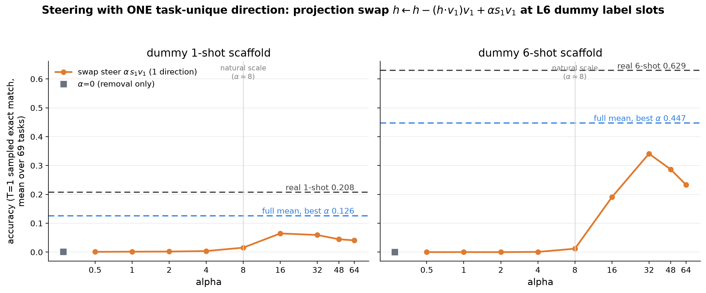

**Mean-free steering.** Dummy-slot injection of the mean-removed read feature (per-task
vector minus the shared L6 mean): 6 slots 0.000 → 0.339 at best $\alpha$ vs 0.447 for the
full vector; 1 slot 0.126 full vs 0.075 mean-free. The shared mean alone: ≤0.013 anywhere.
cos($m_A$, shared mean) is 0.72–0.93 per task (mean 0.85), i.e. the carrier is most of the
vector's norm but none of its identity.

**Single-direction swap.** Remove the own top task-unique direction's natural projection
at L6 target slots and write $\alpha \cdot s_1 \cdot v_1$ instead: aggregate accuracy is
dead through $\alpha=4$ (≤0.001, and removal-only = baseline), ignites at $\alpha=8$–16
(0.007 → 0.160), peaks 0.327 at $\alpha=32$, declines by 64. Per-task best 0.351. The code
is one direction, but the model only responds well above its natural scale.

**Hypothesis 1 — carrier repairs the defective "_" base: rejected.** On a scaffold whose
six demo targets are real words sampled from *other* tasks' output pools, full-mean
steering reaches 0.494 and the swap 0.418 (aggregate 0.388) — the fullmean−swap gap
(0.076 per-task best / 0.107 aggregate) is unchanged to three decimals vs the underscore
base, while the real-word base lifts both methods ~+0.05 uniformly.

**Hypothesis — attention capture: attention does not mediate.** Mean L13 cue→target
attention: real 1-shot 0.056, dummy unsteered 0.038; full-mean steering raises it to 0.045
($\alpha=1$) but at its accuracy-peak dose attention is back at or below unsteered (0.028
at $\alpha=4$); the swap leaves attention flat (≈0.038) at every $\alpha$ including its
accuracy peak. The carrier attracts cue attention, but accuracy moves without it.

**Error anatomy (10,350 generations each).** Swap vs fullmean at matched best doses:
correct 0.373 vs 0.447; underscore-echo 0.055 vs 0.018 (3×); own-pool wrong-answer rate
*identical* (0.145 vs 0.137); other-pool 0.078 vs 0.095; unparseable/"other" 0.326 vs
0.293. Of the 2,122 items fullmean gets right and swap gets wrong, 55% are "other"
(degraded on-task attempts), only 8% underscore echoes. The gap is not a different task
being executed — it is the same task executed worse, favouring a *ratio-preserving
composite code*: downstream machinery expects carrier and code in natural proportion.
Sources: `bottom_up_read_features/steering_results/{meanfree_dummy, taskunique_svd_dummy,
randlabel_swap, attention_to_label_1shot, error_analysis_swap_vs_fullmean}/`.

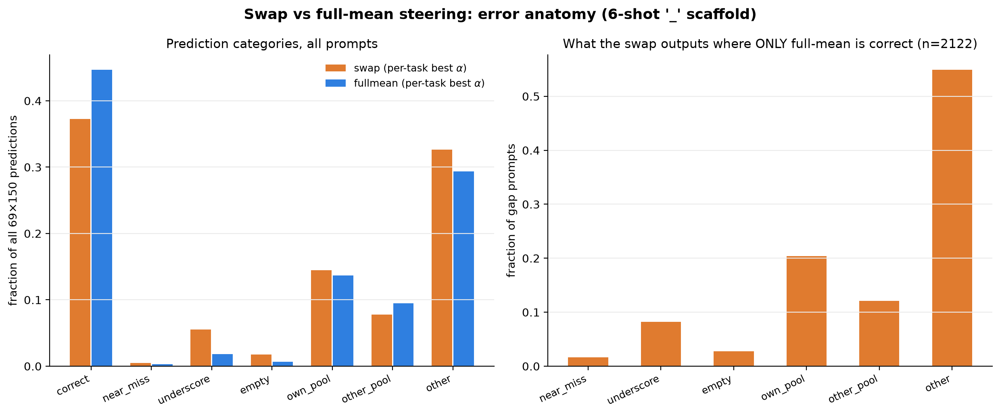

## J. The rotation analysis in detail

**Data.** X = task-mean target-token residual $m_A(L)$ (`label_resid_means`, L ∈ {6, 13}),
Y = task FV (mean of the 150 per-prompt FVs); 55 train / 14 held-out, fp64.

**Congruence.** All-69 family-centered pairwise cosines: read vs write Pearson 0.932 (L6)
/ 0.959 (L13), Spearman 0.905 / 0.946; centered-norm correlation 0.786 / 0.790; gram-CKA
0.930 / 0.952. Subspace overlap in activation space: feature-side alignment 0.014 / 0.051;
principal cosines between the 90%-variance subspaces (32 vs 28 dims): max 0.256 / 0.407,
median 0.091 / 0.171. Cross-family matched cos($m_A$, $v_A$) centered: mean 0.076 (L6) /
0.195 (L13), mismatched pairs ≈ 0; matched exceeds the mismatched 95th percentile for
40/69 (L6) and 57/69 (L13) tasks. Highest matched overlap: the translation family
(0.31–0.35 at L13); lowest: target-classification tasks (≈0.00–0.10) — the same family
that transfers worst through the map.

**Fits.** Predictor: $\hat v_A = \bar v + s \cdot R\,(m_A - \bar m)$ with means from the
train tasks; $R$ by orthogonal Procrustes on the 55 centered train pairs; $s = 1$
(rotation) or the trace-formula scalar (rotation+scale); ridge = dual with intercept,
$\lambda$ by LOO-CV. Held-out testmean $R^2$: L13 — ridge 0.657, rotation 0.625,
rotation+scale 0.624 ($s = 0.93$); L6 — ridge 0.642, rotation 0.482, rotation+scale 0.586
($s = 1.55$; centered read norms 30.7 vs FV 49.1). Held-out mean cos of centered
predictions: rotation 0.82 vs ridge 0.84 (L13). The fitted ridge map's singular spectrum
on the train span decays smoothly ($\sigma_{10}/\sigma_1 \approx 0.7$,
$\sigma_{40}/\sigma_1 \approx 0.42$) — the ~5% it adds over the rotation is
direction-dependent gain, not a different geometry.
Source: `understanding_read_write_linear_map/`.

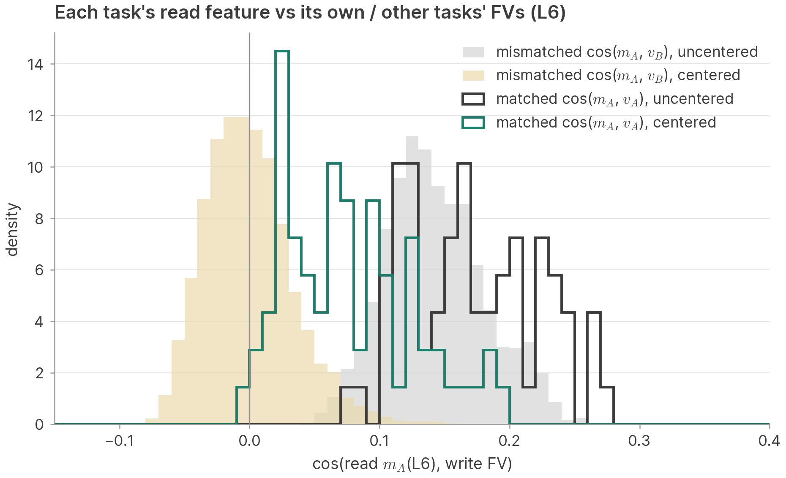

## K. Estimator variant: ten-site-average read features

Every quantity in this paper estimates the read feature from the residual at the **last
token of the final demonstration's target** (150 prompts per task). An alternative
estimator averages the same residual over **all ten** demonstrations' target tokens before
taking the task mean — ten times more sites, and therefore a lower-noise estimate of the
same feature, at the cost of blending in shallow-context positions. The two estimators'
task-unique top directions nearly coincide ($|\cos(v_1^{\mathrm{final}},
v_1^{\mathrm{avg10}})|$: median 0.979, min 0.966 over the 69 tasks), and every qualitative
result is identical under both; the ten-site average gives sharper numbers exactly where
estimation precision matters (few-direction ablation bases, regression inputs), and
indistinguishable numbers for prompt-mean-level steering:

| Result (69-task mean) | final-site (main text) | ten-site avg |
|---|---:|---:|
| Task-unique 11-dir ablation, own mean-abl (6-shot, base 0.629) | 0.095 | 0.063 |
| — top-3 SVD | 0.099 | 0.066 |
| — top-1 direction | 0.146 | 0.103 |
| — top-3, L6–9 band only | 0.135 | 0.096 |
| — top-1, L5–7 band only | 0.130 | 0.097 |
| Single-direction swap steering, best aggregate $\alpha$ | 0.327 | 0.341 |
| Read→write ridge, held-out per-prompt $R^2$ (peak layer) | 0.557 (L12) | 0.653 (L13) |
| Read→write ridge, held-out centroid $R^2$ | 0.636 | 0.692 |

Counterfactual controls sit at baseline under both estimators, and 1-shot specificity
holds under both.

---

# References

- Todd, E., Li, M. L., Sen Sharma, A., Mueller, A., Wallace, B. C., & Bau, D. (2024).
  *Function Vectors in Large Language Models.* ICLR 2024.
  [arXiv:2310.15213](https://arxiv.org/abs/2310.15213).
- Hu, X., Yin, K., Jordan, M. I., Steinhardt, J., & Chen, L. (2025).
  *Understanding In-context Learning of Addition via Activation Subspaces.*
  [arXiv:2505.05145](https://arxiv.org/abs/2505.05145).
