# Read and Write Features for In-Context Learning

## Abstract
(TBD)

## Introduction
We study how models learn in context. Namely, previous work has shown the existence of "function vectors" which are the write features that are causal representations of functions at the tokens directly prior to the output of the function. We define this as the write feature so that we can introduce the concept of read features which are representations that the model uses to infer the task, but not actually imitate it. The **read feature** sits at demonstration target tokens in the early layers, and is causal in forming the **write feature** at cue tokens in the middle layers and drives the answer. We show that both are causally necessary and sufficient and various claims about the nature of these features and their relationship.

## Related Work
(TBD)

## Terminology

Notation used throughout (see the project glossary, `task_id_im_subspaces.md`):

- $L$ is the set of layers and $h$ denotes a head.
- $d_{\mathrm{model}}$ is the residual-stream width and $d_{\mathrm{head}}$ the per-head width.
- $\mathcal{T}$ is the task universe (antonym, synonym, English–French, country–capital, …)
  and $A \in \mathcal{T}$ is a task.
- $p_A^j$ is the $j$-th prompt for task $A$, and
  $\mathcal{P}_A = \{p_A^j\}_j$ is the prompt set for $A$ (varying in ICL context length,
  unless explicitly stated otherwise).
- $z^t_{\ell, p_A^j}$ is the residual stream at layer $\ell$ at token $t$ for prompt $p_A^j$ and $z^t_{\ell, A}$ is the same but averaged across all prompts in $\mathcal{P}_A$
- $h(p_A^j) \in \mathbb{R}^{d_{\mathrm{model}}}$ is the head activation at the final token
  position (final cue token) on prompt $p_A^j$.
- The **head vector** $h_A = \frac{1}{|\mathcal{P}_A|} \sum_j h(p_A^j)$ is the average head
  activation for task $A$.
- The **function vector** $v_A = \sum_{h \in H} h_A$ for task $A$, where $H$ is the selected
  subset of heads in our definition of function vectors.
- The **per-prompt function vector** $v^j_A = \sum_{h \in H} h(p_A^j)$ for prompt $j$ on
  task $A$. Note that averaging the per prompt function vectors  gives the function vector $v_A = \frac{1}{|\mathcal{P}_A|} \sum_{j} v^j_A$
- Note: "Layer $\ell$" means the residual stream at the output of transformer block $\ell$

## Setup

- **Model:** GPT-J-6B (28 layers × 16 heads).
- **Tasks:** 69 simple short-string ICL tasks (translation, morphology, world knowledge, string ops,
  classification, numerical); fixed split of 55 train / 14 held-out tasks
- **Prompts:** Each task has 150 fixed 10-shot prompts per task (which we can truncate to get varying length prompts). We use temperature-1 sampling everywhere unless explicitly mentioend otherwise.

## The circuit and our claims

Our main contribution is idenitfying and studying a two-step general circuit for in-context learning of simple functions, summarised in
the figure below. We separate out the circuit into **read features**, where the model learns what the task is, and **write features**, where the model has to execute the task. Each of our simple function go from an input to a target separated by standard "Q:" and "A:" formatting (for example the country to capital task has the country as the input and the capital as the target). At the end of each demonstration, the target token attends to its input and a representation of the task can be found there - the read feature. We refer to the ":" token in "A:" as the cue token, which is where the model is forced to execute the task. We show that the cue attends to the targets, and along the way the read feature
is (approximiately linearly) transformed into the write feature. We summarise our findings with the following circuit diagram drawing:


The numbered marks in the figure are the claims of this paper and they form the structure of this paper.

We define the write feature as function vectors from (Todd et al., 2024), who established it's existence and causality - injecting an FV triggers the task on out-of-distribution contexts. We will use function vectors and write features interchangeably in the context of this paper. Claim 1 is a controlled recreation of a result already
shown there. The rest of the claims are to our knowledge novel.

| # | Claim | Headline evidence | Section |
|---|---|---|---|
| 1 | General write features exist at middle layers and are low dimensional per-task | A single vector can steer models to perform the task on zero shot prompts with peak accuracy when injected in middle layers (shown in Todd et al. 2024). The 37 heads selected from train tasks only, can be used to form function vectors for 14 never-seen tasks' accuracy from 0.09 to 0.73 (same as train tasks' accuracy uplift to 0.75). | Claim 1 |
| 2 | Read features exist at early layers | Write features are linearly decodable from single target-token activations at early layers | Claim 2 |
| 3 | Read features are causal and low dimensional per-task | We can achieve bidirectional control on task performance using 2 directions per task. Sufficiency: Injecting the shared carrier plus one task-unique direction in dummy prompts recovers 95% of real prompt accuracy (0.597 vs 0.630). Neccesity: ablating one task-unique direction kills ICL (accuracy drops from 0.629 to 0.132) | Claim 3 |
| 4 | Read features are causal for the formation of write features | Label token injection steers the cue representation toward the task's own $v_A$ (cos 0.18 → 0.42) | Claim 4 |
| 5 | Read features appear earlier than write features | Read feature cosine similarity peaks at target tokens, L7. Write feature cosine similarity peaks at cue tokens, L13. | Claim 5 |
| 6 | Read features linearly map to write features | Training a linear map on a set of train tasks predicts held-out tasks' mpaping ($R^2 \approx 0.64$). | Claim 6 |
| 7 | Write-feature presence predicts task accuracy | Presence at the cue token and task accuracy rise together | Claim 7 |

## The dataset

We study simple ICL tasks, each a single input to output mapping going to and from
words, numbers, or dates, rendered as Q:/A: pairs (e.g. antonym: `Q: unfair` /
`A: fair`). The tasks span six rough families:
translation (english-spanish, german-english, …), morphology (present-past,
plural_to_singular, …), world knowledge (country-capital, person-sport, …), string
operations (capitalize, first_three_letters, …), classification (sentiment, animal_class,
…) and number/date tasks (next_number_digits, iso_date_to_month, …). We consider a universe of ~120 tasks and prune out tasks that the model cannot complete sufficiently well to end up with 69 tasks that we use for the rest of the study. (Completing a task sufficiently well here means that the model can achieve at least 30% accuracy on 10 shot prompts from that task). Worked examples of every prompt structure used in this paper (clean n-shot, zero-shot, mixed-task mixed-target, dummy-target, random-target) are given in Appendix A.

## Claim 1: General write features exist at middle layers and are low dimensional per-task

Following the work of Todd et al. (2024) and Hu et al. (2025), we use sparse optimisation to
select a subset $H$ of attention heads, and form each task's function vector by adding
together those heads' mean activations at the final cue token of 10 shot prompts: $v_A = \sum_{h \in H} h_A$
(as in the Terminology section). Our sparse optimisation selects $|H| = 37$ heads.

The 37-head set is chosen on the 55 train tasks only, yet using that same selection of heads and forming function vectors on held-out tasks still gives an effective steering vector. We show effectivenss of the write feature on 0 shot prompts (e.g. `Q: unfair` /
`A:`) and on 10-shot prompts whose demonstrations come from other tasks to obfuscate the task
(e.g. `Q: 2597` / `A: 2590s`, `Q: Mbale District` / `A: Uganda`, … eight more demonstrations,
each from a different task … `Q: miraculous` / `A:` — the mixed-task, mixed-target structure;
see Appendix A). We can see that under both metrics, the steered performance shows strong uplift in accuracy.


*Steering with the train-selected 37-head write feature transfers to held-out tasks. The
per-task view shows the lift in all tasks.*

## Claim 2: Read features exist at early layers

Next, we want to understand where computations related to the write features might lie. We do this by getting activations for each (token position, layer) in 6 shot prompts and train a (ridge) regression on a train set to predict the write feature for that task (for more details see Appendix B). We can see expected patterns such as the function vector becoming more linearly decodable as you go deeper into the prompt (i.e. after the model has seen more examples of the task), but also at early layers (L5-L10), the target tokens contain more linearly decoadable parts of the write feature than the cue tokens! This suggests there is a computational node prior to the write feature, which we define as the read feature.


*Labels are informative from early layers and early tokens, the cue catches up example by example. The bold example-6 cue line peaks at L13 ($R^2$ 0.663). The weakest cue line is example 1, where the model has not seen a full example of the task yet. The full token × layer grid is in
Appendix B. Source: `FV_linear_decodability/token_layer_regressions/`.*

(Note: The closest observation in Todd et al. (2024) is attentional: their FV heads primarily
attend to the demonstrations' output (target) tokens (their Figure 3b), but they do not go into detail on the nature of the relationship)

## Claim 3: Read features are causal and low dimensional per-task

We test for read feature candidates that are causal and in this identified region by averaging the activations of the layers at the target token and using it to steer on dummy prompts. Namely: let $t^j_{\mathrm{tgt}}$ be the position of the last token of the final demonstration's target in prompt $p_A^j$. The candidate read feature at layer $\ell$ is the task mean of the residual stream at that position,

$$
m_A(\ell) \;=\; \frac{1}{|\mathcal{P}_A|} \sum_{j} z^{\,t^j_{\mathrm{tgt}}}_{\ell,\, p_A^j},
$$

computed from the 150 clean 10-shot prompts, giving one candidate per layer. 

To test a candidate, we steer with it on dummy prompts (Appendix A). Dummy prompts are the same as a 1-shot prompts but with the target token in the example replaced with `_`. We steer with the mean activation direction in the residual stream at the dummy `_` token:

$$
z^{\,t}_{\ell} \;\leftarrow\; z^{\,t}_{\ell} + \alpha\, m_A(\ell),
$$

with $\alpha$ the injection strength.


Then we sweep over all layers (and steering strengths for each layer) and see if any layers can steer the model to complete the task on 1 shot dummy prompts.


*Steering works only in a narrow early-layer window, peaking at L6 (accuracy of 0.126, L7 essentially tied at 0.125), coinciding with the early-layer band where the write feature is linearly decodable at target tokens (Claim 2). The dashed line is the baseline of mean accuracy of a real 1-shot prompt, so the single best-layer injection recovers a majority of real prompt accuracy.*

Steering peaks in the L5–7 band, so we build the read feature from the task means of those
three layers. We start by studying the average $\bar m_A = \tfrac13\sum_{\ell=5}^{7} m_A(\ell)$. We find that the 69 have a mean pairwise cosine of 0.73, suggesting that most of every task's vector is a component shared by all tasks. We define the **shared carrier** $c$ as the the cross-task mean of $\bar m_A$. To isolate what is specific to task $A$ we project the shared carrier
direction out of each layer's task mean and average the three residuals:

$$
c \;=\; \frac{1}{|\mathcal{T}|}\sum_{A'} \bar m_{A'}, \qquad
\hat c(\ell) \;=\; \frac{\sum_{A'} m_{A'}(\ell)}{\big\|\sum_{A'} m_{A'}(\ell)\big\|}, \qquad
r_A(\ell) \;=\; m_A(\ell) - \big\langle m_A(\ell),\, \hat c(\ell)\big\rangle\, \hat c(\ell),
$$

$$
u_A \;=\; \frac{1}{3}\sum_{\ell=5}^{7} r_A(\ell),
$$

where $\hat c(\ell)$ is the **cross-task** carrier direction at layer $\ell$. $u_A$ is orthogonal to the shared carrier by
construction. We call $u_A$ the **task-unique component** of the read feature. Its unit
direction $\hat u_A = u_A/\|u_A\|$ is what we ablate below, and $c + u_A$ is what we inject.
(See Appendix G for other variations of steering and ablation)


**Necessity:** We take clean 1 shot and 6 shot prompts and ablate out the the task unique direction,$u_A$, out of the residual stream at all the target tokens and observe how the task accuracy changes. As as control, we also ablate the task unique direction of a different task, $u_{A'}$ at all the target tokens as well. We show that ablating $u_A$ destroys task accuracy, whilst ablating $u_{A'}$ does not - showing that $u_A$ is a causally necessary direction for the model learning the task.

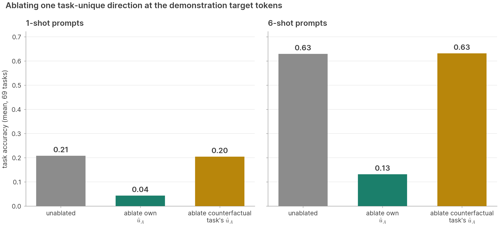

*Ablating one task-unique direction kills the task's own ICL while the counterfactual control
sits at baseline.*

Note: Why not simply ablate the raw mean direction $m_A$ itself? That was our
first attempt, but found that the counterfactual control performed equally as well as the specific task - likely because the shared direction contains some relevant computation for general in context learning. The
motivation for the task-unique setup, and the full list of variations we tried are in
Appendix D.

**Sufficiency:** We set up dummy 6-shot prompts (same set up as before where we replace the correct answers with `_`), and
inject the shared carrier plus the task-unique part:

$$
s_A \;=\; c + u_A, \qquad z^{\,t}_{\ell} \;\leftarrow\; z^{\,t}_{\ell} + \alpha\, s_A
\quad\text{at every dummy target slot } t .
$$

A 1-shot sweep over injection layers (Appendix G) places the optimal layer at early layers ( L0–L3). We therefore inject at L0 on the 6-shot dummy prompts at all the target tokens and
sweep $\alpha \in \{0.5, 1, 2, 4\}$. At $\alpha = 2$ the six steered dummy slots lift
accuracy from 0.000 to 0.570, which is 90% of what six real demonstrations achieve.

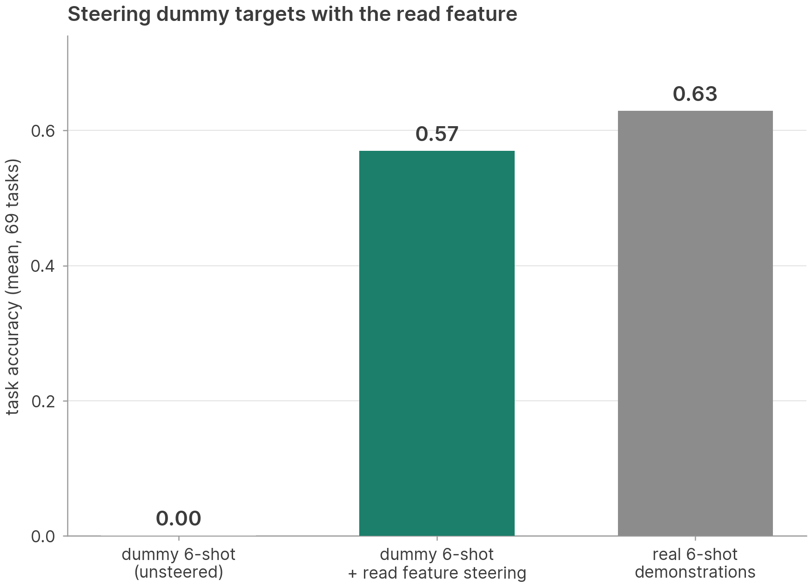

So to recap:
1. We decompose the mean layer activations into a shared carrier direction and a task unique direction
2. Ablating the task unique direction at the target tokens kills task performance
3. Steering with the combination of the shared carrier direction and the task unique direction can boost task performance.

This shows that by controlling the subspace spanned by the shared carrier and the task unique component, we can acheive bidirectional control - suggesting that this 2D subspace is responsible for the model reading these simple functions in context. We will refer to the acitvations in this 2D subspace as **read features**.

## Claim 4: Read features are causal for the formation of write features

So far, we have shown that read features and write features are causal for the model to learn tasks, but have not studied the relationship between the two. We go back to the six-shot dummy prompts from the previous section and inject $s_A$ at the target tokens, but instead of measuring the model output, we measure the residual stream at the final cue token for presence of the write feature (i.e. the task's function vectors). We inject $s_A$ at different strengths, $\alpha$, and observe the change in cosine similarity of the residual stream at L13 at the final cue token with that task's respective write feature. We find that presence increases as you increase the strength of the read feature steering.

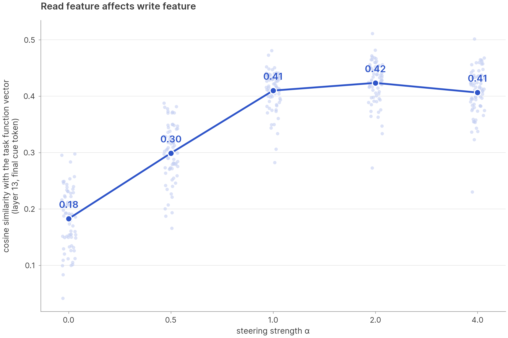

*Cosine between the L13 residual at the final cue token and the task's function vector, as a function of injection strength. Injecting the carrier plus the task-unique direction at the target tokens moves the write
site toward the task's function vector. More variants can be found in Appendix G*

## Claim 5: Read features appear earlier than write features

Now that we have defined our read and write features and shown that they are a causal mechanism for bidirectional control of the task, the next thing to pin down is the mechanistic story of where they appear in the residual stream. We study the mean cosine between the residual stream and each feature, by layer and token type, over clean 10-shot prompts. The task-unique read direction $u_A$ peaks at early layers of target tokens whilst the write features peak at the middle layers of cue tokens.

Note: Since we have two axis for the read feature subspace, we measure cosine simlarity for each part (shared carrier and task-unique) separately, but they both peak at around the same layers.

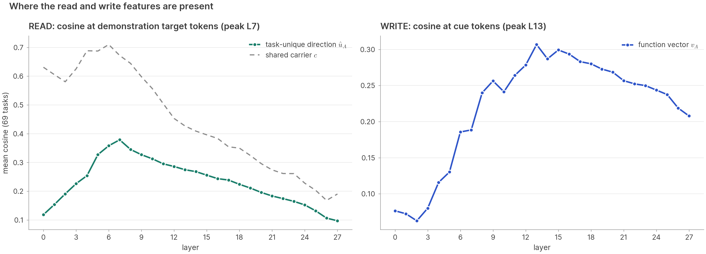

## Claim 6: Read features linearly map to write features

A single linear map from the read feature to the write feature, fit on the 55 train tasks,
predicts the *held-out* tasks' function vectors. The input is the task unique read feature of Claim 3, $u_A$, and targets are the tasks' write features. Ridge regression from $u_A$ to the task write feature reaches held-out $R^2 = 0.64$ on the 14 held-out tasks. The map is one linear transform shared across tasks. (See Appendix E for more details of how the regression was trained and other variations). We can also see that the cosine between the predicted and the true function vector averages 0.89 whilst predicting just the generic train-mean FV (dashed line) would only score 0.64.

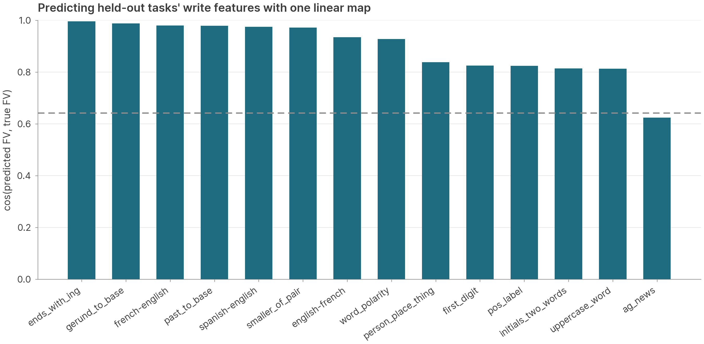

*Each bar is one held-out task. The cosine between the write feature predicted from its read feature by the linear map (fit on the train tasks) and its true write feature. The dashed line is the same cosine when the generic train-mean write feature vector is used as the prediction for every task (mean 0.64), as a naive baseline*

We study the geometry of the linear map in more detail in Appendix H.

## Claim 7: Write-feature presence predicts task accuracy

Can we predict the model perfomance on these simple tasks before we see the model output using a mechanisitic metric? We find that the strength of the write feature at the query cue can be used to predict performance. 

We define strength of write feature as the cosine similarity of the residual stream with the write feature for that task (mean cosine similarity across layer 9 to 20). We study prompts from n = 0…6 in context demonstrations. We try other variations of measuring cosine similarity in Appendix F and find similar results across the board. We group different presence strengths and plot against model accuracy to get a monotone curve (shown below). Below cos 0.15 the model has 0% accuracy and by the 0.35–0.45 bucket it achieves 50% accuracy. These results are for all tasks grouped together, if we study each task at a time, the spearman coefficient is much higher (~0.95).


## Conclusion and Future Work

(Concise version for now, needs fleshing out)

We have shown the the general machinery that models use to learn simple functions can be viewed as a two step process of reading the task and writing the task (task execution). Future work could see if this machinery or two step breakdown extends to more real world settings like in context jailbreaks and in context persona drift.

---

# Appendix

## A. Setup & protocol

**Task pool.** We start with ~120 tasks, and test the model on 6 shot prompts to keep only tasks that the model can complete (otherwise it wouldn't make sense to study their activations). We use a threshold of 30% accruacy or higher, which means 69 tasks survive the filter. Each task used 150 unique prompts to determine the accuracy.

**Full task list.** *Train (55):* adjective_to_adverb, adjective_to_noun,
agent_noun_to_verb, animal_class, animal_plant_object, antonym, article_choice,
capitalize, capitalize_first_letter, city-country, compound_first, concrete_abstract,
contains_letter_e, country-capital, day_after_textual_date, english-italian,
english-portuguese, english-spanish, first_three_letters, french_noun_gender,
german-english, german_noun_gender, gerund_to_past, hypernym_category, iso_date_to_month,
iso_date_year_plus_one, landmark-country, language_identification, larger_of_pair,
larger_than_1000, lowercase_first_letter, lowercase_word, national_parks,
natural_manmade, next_item, next_month_of_date, next_number_digits,
number_word_to_digits, park-country, person-instrument, person-sport,
plural_to_singular, present-past, prev_number_digits, product-company, sentiment,
singular-plural, singular_or_plural, spanish_noun_gender, starts_with_vowel,
third_person_to_base, titlecase_phrase, us-city-state, verb_tense_label,
verb_to_third_person. *Held-out (14):* ag_news, ends_with_ing, english-french,
first_digit, french-english, gerund_to_base, initials_two_words, past_to_base,
person_place_thing, pos_label, smaller_of_pair, spanish-english, uppercase_word,
word_polarity.

**Head selection.** A function vector is the summed output of a small set of attention heads
(Todd et al., 2024). The task signal at the cue token is carried by a sparse subset of the
model's 448 heads, so the heads have to be selected before their outputs can be summed. Todd et al. rank heads by their average indirect effect on shuffled-label prompts. Hu et al. (2025) show that selecting them by sparse optimisation leads to better results, so we learn a gate over all heads jointly using a similar sparse optimisation. Pooled sparse optimisation: a gate $c \in [0,1]^{448}$ over all heads, steering loss on zero-shot prompts summed over the 55 train tasks, + $\lambda\|c\|_1$; $\lambda = 0.005$ by 5-fold task cross-validation. We keep heads that have $c > 0.8$, which are 37 heads spanning layers 3–27, densest at 12–15.

**Definitions**: head vector $\bar h_A$ = mean final-cue-token output of head $h$ on task $A$'s prompts; function vector $v_A = \sum_{h\in H} \bar h_A$. Per-prompt FV $v^j_A$ = the same sum on a single prompt.

**Readout.** Temperature-1 sampled generation, exact match against the gold target, seeded
per prompt; steering evaluation reports each task's best injection layer at $\alpha=1$
unless stated otherwise.


### Prompt structures
**One example of every prompt structure used in this paper** 

(all examples use the antonym task; every structure ends at the query cue `A:`, where
generation is scored)

*Clean n-shot* — the 150 fixed 10-shot prompts; an n-shot prompt is the same prompt
truncated to its first n demonstrations (zero-shot keeps only the query):

```
Q: unfair
A: fair

Q: anterior
A: posterior

⋮   (8 more demonstrations)

Q: due
A:
```

*Zero-shot* (the steering test bed of Claim 1):

```
Q: miraculous
A:
```

*Mixed-task, mixed-target 10-shot* (Claim 1 test setting) has each demonstration drawn
from a *different* task with its own correct target (here: year_to_decade,
landmark-country, spanish-english, …); the pairs are internally correct but only the
query belongs to the evaluated task, so the context provides format but no task
identity:

```
Q: 2597
A: 2590s

Q: Mbale District
A: Uganda

⋮   (8 more demonstrations, each from another task)

Q: miraculous
A:
```

*Dummy-target scaffold* (read-feature sufficiency, Claim 3) the task's own inputs, but
every target is replaced by a bare `_`, so the prompt does not teach the correct task (unsteered accuracy
0.000):

```
Q: unfair
A: _

Q: anterior
A: _

⋮   (6 demonstrations in total)

Q: due
A:
```

*Random-target scaffold* (scaffold-robustness control, Appendix C/G) — as the dummy
scaffold, but each `_` is replaced by a real word sampled from *other* tasks' output
pools (illustrative targets shown), so the targets are actively wrong rather than empty:

```
Q: unfair
A: piano

Q: anterior
A: Uganda

⋮   (6 demonstrations in total)

Q: due
A:
```

## Write features are low dimensional

**Across the pool: a 22-dimensional subspace carries most of the steering.** The top 22
uncentered PCs of the 69 task-mean function vectors (90% of their energy) define one fixed
subspace. Projecting each task's $v_A$ into it and rescaling the strength per task
($\alpha$ up to 2, since projection shrinks the norm) recovers zero-shot steering of 0.68
on both train and held-out tasks, against 0.75 / 0.73 for the full 4096-dimensional
vectors.


**Per task: a single direction, with bidirectional control.** For an individual task the write feature is effectively rank one. The same unit direction $\hat v_A$ that steers
zero-shot prompts (sufficiency) is also necessary: ablating (zero ablation and mean ablation) it out of the residual stream at just the final cue token collapses 6-shot ICL whilst ablating a counterfactual task's direction
costs doesn't impact it anywhere near as much. We show the full results in detail on 1 shot and 6 shot prompts.


*Removing one direction at one token position destroys ICL — at 6 shots and at 1 shot —
only for the task that owns the direction (layer clamp 9–27). Source: `FV_ablation/`.*

## B. Decodability grid in detail

**Regression design: train on per-prompt FVs, evaluate on task FVs.** Each cell's ridge
is fit with one row per (task, prompt) — X = that single position's residual activation,
Y = that prompt's *per-prompt* function vector $v^j_A$, giving 55 tasks × 150 prompts =
8,250 training rows. Fitting task-level targets directly would leave 55 samples for a
4096 → 4096 linear map, a massively over-specified problem that a ridge can satisfy
without learning anything transferable. The per-prompt targets both multiply the sample
count 150-fold and scatter around each task's mean. This within-task spread is largely
unpredictable from a single token activation, so it acts as target noise that discourages
the fit from chasing prompt-specific detail rather than the task-level signal. We also empirically got better results for predicting the task level function vector by training to predicting prompt level function vectors. Evaluation and all held out R^2 claims are scored on the the *task* FV $v_A$, which is what we actually care about.

- Grid rows: each demonstration's cue token and the last token of its target, plus the query cue.
- Peak cell: L15, demo-10 cue token, held-out $R^2$ 0.688
- By layer: steep rise L0 → L8 (0.22 → 0.56), plateau L12–L16 (~0.58), slow decay.
- Sawtooth pattern: at L6 the cue trails its own demo's target by ~0.48 $R^2$ at example 1,
converges by example 5–6, and inverts by example 10.
- Embedding baseline: target tokens 0.245 (token identity alone carries a share of the
  early-layer signal); cue and input positions are at or below zero.


*The full token × layer grid behind the Claim 2 line figure. The bright band is the cue
and target tokens of later demos at layers ~8–17.*

## C. Read-feature steering in detail

**Where to inject?** The layer choice comes from a 28-layer sweep on the 1-shot
dummy-slot scaffold ($\alpha \in \{0.5, 1, 2, 4\}$, best per layer, mean taken at the same
layer as the injection): accuracy climbs from 0.018 at L0 to the 0.126 peak at L6 (L7
essentially tied at 0.125), then falls off - 0.070 at L8, 0.010 at L12, and the
~0.003 from L13 onward.

**Which vector steers.** On the 1-shot dummy-slot scaffold, the raw task mean beats the engineered alternatives that we tried: raw mean @L7 0.121 > mean-difference (task mean − shared mean) 0.082 > sparse-selected target token heads sum 0.050 (same as function vectors but on target tokens instead of the final cue token).

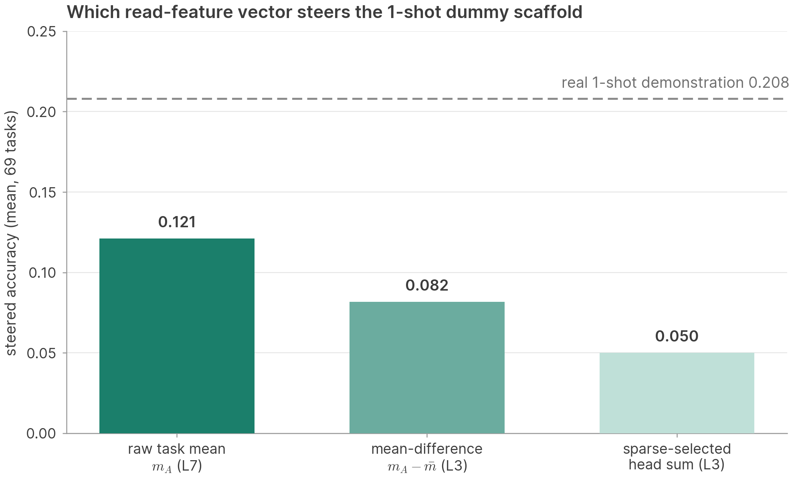

**Dose and slots.** The 1-shot injection peaks at $\alpha=2$ whilst six slots peak at $\alpha=4$. 17/69 tasks match or beat real 6-shot demos, the best are string/format tasks
at near-ceiling.

**Scaffold robustness.** The results hold regardless of what target replacement is used. For example, instead of `_`, if we use 6-shot prompts whose six demo targets are real words sampled from other tasks' output pools, full-mean steering reaches 0.494 (vs 0.447 on underscores) — the injection overrides actively wrong target content, not just empty slots.

**No low-dimensional shortcut across tasks:** Restricting the steering vector to top-k
centered PCs of the 69 task means retains accuracy roughly linearly in k with inflection point.


## D. Read-feature ablation in detail

**Ablating the raw mean direction fails:** The
natural first attempt is to ablate the task's own unit read-feature direction, e.g.
$\hat m_A(\mathrm{L6})$, at the target tokens. This kills ICL (own 0.009 from a 0.629
baseline), but the counterfactual control also collapses accuracy (0.278), so the kill cannot be attributed to task
identity. Upon further investigation, we realied that the read features are far more similar across tasks than function vectors are (mean pairwise cosine 0.727 vs 0.393, see figure below), so any task's
raw direction contains mostly the shared carrier, and removing it removes the same
neccesary shared component regardless of which task the direction came from. This is
what inspired the decomposition of $m_A$ into a shared carrier and a task-unique part used in Claim 3 and ablating only the
task-unique part, which did the trick.


**Ablation Variations:** We ablate a per-task subspace at every demonstration target token, at the input of every block. Mean-ablation replaces the residual's projection onto the subspace with the cross-task grand mean's projection; zero-ablation removes it. The control repeats the operation with another task's subspace. Baselines share prompts and seeds with the steering runs. Besides the main-text direction $\hat u_A$ we report three variants: the task's raw unit read direction $\hat m_A(\mathrm{L6})$ (rank-1); the top-3 SVD directions of the carrier-removed L5–15 task means (a rank-3 version of $\hat u_A$); and an attention-mask control that ablates nothing but blocks the final cue token from attending to the
demonstration target positions.

| Basis (6-shot, baseline 0.629) | Own, mean-abl | Cf, mean-abl | Own, zero | Cf, zero |
|---|---:|---:|---:|---:|
| Rank-1: raw unit read direction $\hat m_A(\mathrm{L6})$ | 0.567 | 0.623 | 0.009 | 0.278 |
| **Task-unique part $\hat u_A$, L5–7 (main text)** | **0.132** | **0.632** | 0.120 | 0.614 |
| Top-3 SVD of carrier-removed L5–15 means | 0.099 | 0.629 | 0.089 | 0.608 |
| Attention-mask control (cue → demo targets) | 0.046 | | | |

Three readings. (1) The raw direction cannot separate task identity from the carrier:
mean-ablating it barely hurts (0.567), zero-ablating it kills own *and* counterfactual
(0.009 / 0.278), because the direction is mostly the shared carrier, which is load-bearing
but not task-specific. (2) Once the carrier is projected out, the ablation is specific and
the control sits at baseline in both modes (mean and zero coincide because the basis is
orthogonal to the carrier). Three directions kill slightly harder than one (0.099 vs 0.132 at
6-shot; 0.038 vs 0.044 at 1-shot, counterfactual 0.204 / 0.205 against a 0.208 baseline), so
a single direction carries nearly all of the target-side identity code. (3) Blocking the
cue's attention to the demonstration targets collapses accuracy to 0.046: target-token
attention is the route by which the read feature reaches the query.

## E. The read → write linear map in detail

**Layer sweep with the raw per-layer read feature.** A ridge regression from the raw per-layer read feature $m_A(\ell)$ (final-target-site X, per prompt) to the per-prompt function
vector, fit on the 55 train tasks, predicts the *held-out* tasks' function vectors with
$R^2 \approx 0.64$ (0.56 per-prompt, 0.63 at task centroids, reading from L12). The map is
one linear transform shared across tasks — it was never shown the held-out tasks' FVs, yet
it places most of them from their read features alone. The sweep covers all 28 layers:
held-out $R^2$ climbs steeply from 0.28 at L0, plateaus from L8, peaks at L12–13, and
declines only gently to 0.53 at the final layer — task identity stays linearly readable at
the target slots through the entire second half of the network.


*(Convention note: the detailed numbers in this appendix were computed with the ten-site
average of the demonstration target activations as the per-prompt X — the estimator
variant of Appendix I — and have not been re-run under the final-target-site convention;
the main-text Claim 6 numbers and figure use the final-target-site X.)*

**What transfers is the centroid map.** Against per-prompt FV targets the held-out $R^2$
is 0.44–0.50 over L5–L15; the full 28-layer sweep spans 0.26 (L0) to the 0.498 peak (L13)
and still holds 0.46 at L27. Decomposing it, between-task centroid placement carries 0.65
while within-task deviations contribute ≈0.03 — and a held-out-prompt check on train tasks
confirms the within-task share is ≈0.05 even in-distribution. The map is a task-centroid
interpolator; scored against task FVs (the centroid target) it reaches the ~0.7 quoted in
the main text.

**Robustness.** Over 10 random 55/14 splits: held-out $R^2$ 0.469 ± 0.040 (canonical split
at the mean); the oracle ceiling (leave-one-out task-mean predictor) is 0.675. Transfer is
bimodal: morphology/translation tasks sit essentially at their oracle, while
classification-like tasks (pos_label, ag_news, uppercase_word, initials_two_words,
first_digit, person_place_thing) stay near zero under *every* split — their read→write
relation is task-idiosyncratic, not merely under-covered. Neither PCA-90 rank reduction
nor lasso in the PCA basis beats the plain full-dimensional ridge.

**Task-level fit agrees.** Treating each task as one sample (55 train centroids → task FV,
LOO-CV $\lambda$) reproduces the per-prompt sweep where they overlap (held-out $R^2$ 0.683
vs 0.692 at L13, train-mean convention) — consistent with the centroid-memorization
reading: the 55 task centroids already carry all the transferable signal. Despite
n=55 << d=4096, LOO-CV picks the smallest $\lambda$ from L6 on (min-norm interpolation
generalizes; explicit shrinkage hurts). Source: `read_write_relationship/linear_mapping/`.


## F. Presence-vs-accuracy method

For each task and n ∈ 0…6, the 150 fixed 10-shot prompts are truncated to their first n
demonstrations (paired queries throughout). Presence = mean cos between the residual
stream at the query cue and the unit $\hat v_A$, averaged over layers 9–20 (per-layer and
max-over-band variants behave the same); accuracy = the standard temperature-1 sampled
exact match on the same prompts. One point per task per shot count (483 points); the
within-task statistic pairs each task's presence and accuracy across its own seven shot
counts.

**Layer-choice robustness (no cherry-picking).** The headline within-task statistic is
insensitive to where presence is read: every single layer L9–L20, the max over the band,
and the band mean give the *identical* median within-task Spearman ρ = +0.964, positive
in 69/69 tasks — with seven near-monotone points per task, the within-task ranking is the
same at every layer, so the rank correlation saturates. Where the variants do differ is
the pooled point-level correlation over all 483 (task, n) points, which mixes in the
negative between-task relation discussed below:

| Presence variant | Median within-task ρ | Positive tasks | Pooled point-level ρ |
|---|---:|---:|---:|
| L9 | +0.964 | 69/69 | 0.629 |
| L10 | +0.964 | 69/69 | 0.573 |
| L11 | +0.964 | 69/69 | 0.599 |
| L12 | +0.964 | 69/69 | 0.559 |
| L13 | +0.964 | 69/69 | 0.524 |
| L14 | +0.964 | 69/69 | 0.458 |
| L15 | +0.964 | 69/69 | 0.519 |
| L16 | +0.964 | 69/69 | 0.424 |
| L17 | +0.964 | 69/69 | 0.396 |
| L18 | +0.964 | 69/69 | 0.343 |
| L19 | +0.964 | 69/69 | 0.295 |
| L20 | +0.964 | 69/69 | 0.298 |
| max over L9–20 | +0.964 | 69/69 | 0.533 |
| **mean over L9–20 (main text)** | **+0.964** | **69/69** | **0.469** |

Single early layers give somewhat higher pooled values (L9: 0.629) purely through the
between-task component; since the claim is the within-task relationship, the band mean is
reported in the main text as the assumption-free default rather than any per-layer
optimum. Source: `write_feature_and_model_accuracy/correlation_summary.csv` (pooled) and
the per-task recomputation over `presence_vs_acc/<task>.npz` (within-task).

**What the within-task correlation looks like.** Per-task values are tight: minimum
0.643, 25th percentile already at 0.964, maximum 1.000 (per-task list in
`diagnostics_per_task.csv`). Three illustrative tasks — the perfect case, the median
case, and the single worst case in the pool:


*One task = seven (presence, accuracy) points, n = 0…6. Even the worst task
(french_noun_gender, ρ = 0.643) is strongly positive — its rank violations are confined
to the saturated top of its curve, where accuracy plateaus while presence still creeps
up.*

**Between-task, the sign flips** (Simpson's pattern): at fixed n ≥ 2, tasks with higher
presence tend to score *lower* (ρ ≈ −0.3 to −0.4 at n = 3…6), even though every task
individually moves up with n. Diagnostics: a shared-mean control (cos to the grand-mean
FV) does not explain it — the partial correlation is unchanged; a-priori task features
(target token count, output entropy, output-pool size) correlate with presence
(ρ ≈ −0.44…−0.54) and weaken the negative relation but do not remove it (partial
ρ ≈ −0.21…−0.26). Subtracting each task's generic-FV alignment (presence minus
cos-to-grand-mean, L13) strengthens the between-task negativity (ρ −0.39 at n=6), while
alignment to the grand-mean FV itself relates *positively* pooled (ρ 0.54) — the
between-task sign is a property of the task-specific component. Per-prompt granularity
(72,450 generations): pooled point-biserial r = 0.36 (L13), driven by the shot-count
sweep; within a fixed n it is ≈ 0. Sources:
`write_feature_and_model_accuracy/{diagnostics.txt, per_prompt/, baseline_subtracted/}`.

## G. Task-unique steering & the carrier-gap hypothesis tests

*(Convention note: the mean-free and swap headline numbers here use the final-target-site
read feature; the carrier-gap hypothesis tests — random-word scaffold, attention capture,
error anatomy — were run with the ten-site-average swap direction (Appendix I) and have
not been re-run.)*

**Sufficiency with the raw read feature $m_A(\mathrm{L6})$ (the original test).** Before the
decomposition, the causal test injected $\alpha \cdot m_A(\mathrm{L6})$ — the full task mean
at the best layer of the 1-shot sweep — at the dummy target slots. L6 is selected by a full
injection-layer sweep (all 28 layers, 1-shot scaffold, best $\alpha$ per layer): steering
works only in a narrow early-layer window, peaking at L6 (0.126, with L7 at 0.125),
collapsing to 0.010 by L12 and to the ~0.003 floor everywhere later; a task-agnostic
shared-mean control never exceeds 0.013 at any layer. With six dummy slots steered at
$\alpha = 4$ the model recovers 70% of what six real demonstrations deliver
(0.000 → 0.442 vs the 0.630 real 6-shot reference).


**Effect on the write site under the raw $m_A(\mathrm{L6})$ injection.** With
$\alpha \cdot m_A(\mathrm{L6})$ at all six dummy slots (the original sufficiency test above),
the cue-token cosine to the task's own FV at L13 rises from 0.18 to 0.37 between $\alpha=0$
and $\alpha=2$; the task-specific gain over the generic all-task FV is positive on 69/69
tasks (+0.093 at $\alpha=2$) and still rising at $\alpha=4$. Two finer-grained variants
agree. On the 1-shot scaffold the same rotation appears at half strength ($\Delta\cos$ to
own $v_A$ +0.088 at $\alpha=2$, vs +0.044 to the generic FV). And steering *only the first*
target slot shows the effect propagating forward with decay: the task-specific excess
alignment is largest at the very next cue (+0.047 at $\alpha=2$) and falls monotonically to
+0.010 by the query cue — each demonstration's target refreshes a signal that would otherwise
fade. Sources: `read_write_relationship/{bottom_up, bottom_up_1shot, bottom_up_firstlabel}/`.
Under the main-text steering vector $s_A$ the rotation is larger (0.18 → 0.42; task-specific
excess +0.138 at $\alpha=2$); its 1-shot variant shows the same rotation at half strength ($\Delta\cos$ to own $v_A$ +0.121 at $\alpha=2$, vs +0.051 to the generic FV; task-specific excess positive on 68/69 tasks); `read_write_relationship/meanresid_1shot/`.


**Read-feature steering variants (6-shot dummy-target scaffold, 69-task means).** The
main text reports $s_A = c + u_A$ (carrier plus the mean of the three carrier-removed L5–7
residuals); the other vectors built from the read feature, all on the same scaffold and
readout:

| Steering vector | injected at | best acc |
|---|---|---:|
| Full read feature $m_A(\mathrm{L6})$ | L6 | 0.447 |
| Mean-free part $m_A - \bar m$ | L6 | 0.339 |
| Shared carrier alone | any | ≤ 0.013 |
| Single-direction swap $\alpha\, u_A$ (removes the natural $\hat u_A$ component first) | L6 | 0.309 |
| $w_A$ = task's own L6/7 mean + $u_A$ (doubles the task-unique component) | L1 | 0.588 |
| **$s_A = c + u_A$ (main text)** | L0 | **0.597** |
| Real 6-shot demonstrations | — | 0.630 |

The two composites ($s_A$ and $w_A$) were located by a 1-shot injection-layer sweep (all 28
layers, $\alpha \in \{0.5,1,2,4\}$, per-task best $\alpha$): both sit on an L0–L3 plateau
($s_A$ peaks at L0 with 0.194; $w_A$ at L3 with 0.220, L1 tied at 0.219; the matched-site raw
mean $m_A(\ell)$ peaks at 0.126 at L6) and are dead from L12. $s_A$ is the shorter vector
(‖$s_A$‖ ≈ 55 vs ≈ 78) and prefers $\alpha = 2$; $w_A$ additionally carries the task's
residual unique directions and twice the task-unique component, which helps on a single slot
(+0.026 at 1 shot) but not at six (6-shot 0.588 at L1, 0.577 at L3). Not yet run: the full
mean injected at L0/L1 (to separate the injection-layer effect from the vector composition)
and $c + 2 u_A$ (to match $w_A$'s dose). An SVD-based construction of the same objects (top
singular direction $v_1$ of the three unit-normed residuals with coefficient
$n_A = \langle \bar m_A - c, v_1\rangle$) agrees with $\hat u_A$ at median |cos| 0.9993 and
reproduces every number here to ±0.005.

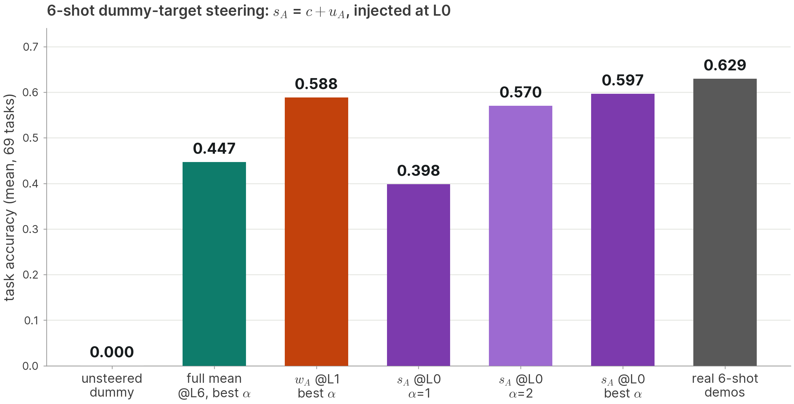

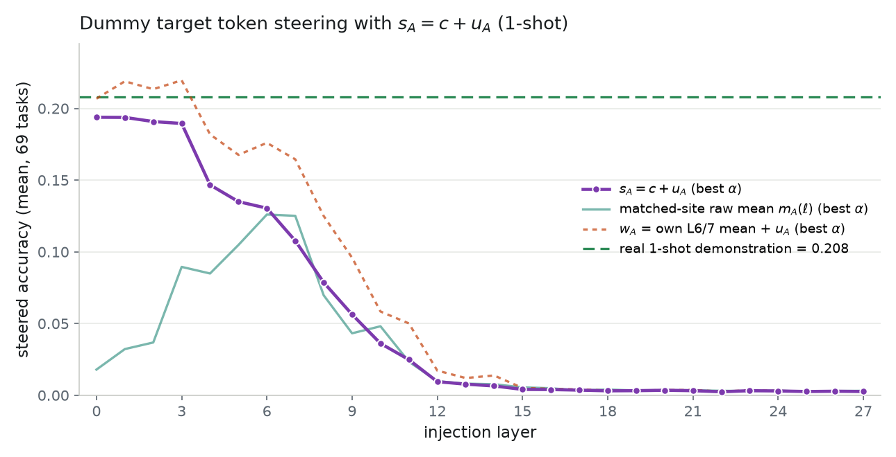

**Injection layer (6-shot, $s_A$).** The 1-shot sweep picks L0–L3, but $s_A$ is built from
L5–7 activations, so we also injected it at each of L5, L6 and L7 on the 6-shot scaffold
(same vector, same prompts, same readout):

| injection layer | $\alpha=2$ | $\alpha=4$ | per-task best $\alpha$ |
|---|---:|---:|---:|
| L0 (main text) | 0.570 | 0.562 | 0.597 |
| L1 | 0.569 | 0.568 | 0.593 |
| L5 | 0.458 | 0.501 | 0.508 |
| L6 | 0.404 | 0.475 | 0.479 |
| L7 | 0.345 | 0.453 | 0.455 |

Three readings. First, accuracy falls monotonically with injection depth (per-task best:
0.597 → 0.508 → 0.479 → 0.455 for L0 → L5 → L6 → L7), so early injection is genuinely
better — but the penalty is about half what the 1-shot sweep suggested (−15/−20/−24% vs
−31/−33/−45%): six steered slots saturate the effect. Second, the preferred dose shifts with
depth (α=2 at L0–L1, α=4 at L5–7; α=1 barely ignites at depth), consistent with a fixed
vector needing more push the fewer blocks remain to process it. Third, injected in its own
band $s_A$ still beats (L5, L6) or matches (L7) the full read feature $m_A(\mathrm{L6})$
injected at L6 (0.447) — so part of $s_A$'s advantage in the main text comes from injecting
early, and part from its composition; at matched layer the composition alone is worth
~0.03. Held-out ≥ train at every layer. Source: `steering_results/meanresid/sixshot_L{0,1,5,6,7}/`
and `sixshot_by_layer.png`.

**Presence maps in full (Claim 5).** Mean cosine between the clean 10-shot residual stream
and each direction, by layer and token type (69-task means). The carrier $c$ is present
everywhere target-like content sits and even at cue and input tokens (0.6–0.7 through L8,
decaying after) — it is a generic "ICL context" component with no positional task identity.
The task-unique direction $\hat u_A$ is a target-token phenomenon: 0.38 at L7 at target tokens
versus ≤ 0.03 at cue and input tokens. The write feature $v_A$ is a cue-token phenomenon
peaking at L13. Under the previous raw-mean definition the
read presence at target tokens peaked at L6 with cos 0.80 — almost all of it carrier.

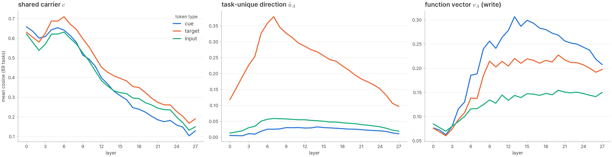

**The carrier gap.** The task-unique part alone recovers about three quarters of full-vector
steering (0.339 vs 0.447) while the carrier alone does nothing; the code side compresses to
one direction (the swap reaches 0.309, close to the mean-free vector, but ignites only at
2–4× the task-unique part's natural magnitude). Why does the carrier help if it carries
no identity? Three hypotheses were tested (detail below): *base repair* — rejected: on a
scaffold whose targets are real words from other tasks' output pools, the gap is unchanged
to three decimals; *attention capture* — partial: the carrier does attract cue→target
attention at L13 (0.045 vs a flat 0.038 for the code alone; real targets 0.056), but
attention does not mediate accuracy — at the accuracy-peak dose attention is at or below
unsteered; *error anatomy* — the code-only condition's extra misses are 3× more
underscore-echoes (0.055 vs 0.018) with *identical* own-pool mapping-error rates (0.145 vs
0.137), and over half the gap is degraded on-task attempts. The surviving interpretation is
a ratio-preserving composite code: carrier and code arrive together at a preserved
proportion in natural prompts, and downstream machinery is calibrated to that composition —
which is exactly what $s_A$ re-imposes at its natural coordinate.


**Mean-free steering.** Dummy-slot injection of the mean-removed read feature (per-task
vector minus the shared L6 mean): 6 slots 0.000 → 0.339 at best $\alpha$ vs 0.447 for the
full vector; 1 slot 0.126 full vs 0.075 mean-free. The shared mean alone: ≤0.013 anywhere.
cos($m_A$, shared mean) is 0.72–0.93 per task (mean 0.85), i.e. the carrier is most of the
vector's norm but none of its identity.

**Single-direction swap.** Remove the residual's natural component along $\hat u_A$ at L6
target slots and write $\alpha \cdot u_A$ instead ($\alpha = 1$ is the task-unique part at
exactly its natural magnitude): aggregate accuracy is dead through $\alpha = 1$ (0.030;
removal-only = baseline), ignites at $\alpha = 2$ (0.244), peaks 0.309 at $\alpha = 4$ and
declines by 8 (0.192). Per-task best 0.346. The code is one direction, but the model only
responds well above its natural scale — without the carrier, the task-unique part alone needs
2–4× its natural magnitude to match the mean-free vector (0.339).

**Hypothesis 1 — carrier repairs the defective "_" base: rejected.** On a scaffold whose
six demo targets are real words sampled from *other* tasks' output pools, full-mean
steering reaches 0.494 and the swap 0.418 (aggregate 0.388) — the fullmean−swap gap
(0.076 per-task best / 0.107 aggregate) is unchanged to three decimals vs the underscore
base, while the real-word base lifts both methods ~+0.05 uniformly.

**Hypothesis — attention capture: attention does not mediate.** Mean L13 cue→target
attention: real 1-shot 0.056, dummy unsteered 0.038; full-mean steering raises it to 0.045
($\alpha=1$) but at its accuracy-peak dose attention is back at or below unsteered (0.028
at $\alpha=4$); the swap leaves attention flat (≈0.038) at every $\alpha$ including its
accuracy peak. The carrier attracts cue attention, but accuracy moves without it.

**Error anatomy (10,350 generations each).** Swap vs fullmean at matched best doses:
correct 0.373 vs 0.447; underscore-echo 0.055 vs 0.018 (3×); own-pool wrong-answer rate
*identical* (0.145 vs 0.137); other-pool 0.078 vs 0.095; unparseable/"other" 0.326 vs
0.293. Of the 2,122 items fullmean gets right and swap gets wrong, 55% are "other"
(degraded on-task attempts), only 8% underscore echoes. The gap is not a different task
being executed — it is the same task executed worse, favouring a *ratio-preserving
composite code*: downstream machinery expects carrier and code in natural proportion.
Sources: `bottom_up_read_features/steering_results/{meanfree_dummy, taskunique_svd_dummy,
randlabel_swap, attention_to_label_1shot, error_analysis_swap_vs_fullmean}/`.


## H. The read→write map is a rotation, but not a low-dimensional one

**The map is, to first order, a rotation.**

What does that linear map actually do? Removing each family's mean answers it. The two task
clouds are already the *same shape*: centered pairwise cosines between tasks match
pair-by-pair (Pearson 0.93, gram-CKA 0.92), and even the centered norms correlate
(r ≈ 0.78). But they occupy *nearly orthogonal directions* of the residual stream: the
largest principal cosine between the two 90%-variance subspaces is 0.26, and each task's
$u_A$ is nearly orthogonal to its own FV (matched cos 0.06, vs 0 for mismatched pairs).

Congruent shapes in orthogonal subspaces is precisely the geometry a rotation solves — and
it does: an orthogonal Procrustes map (fit on the 55 train tasks) plus one global scalar
reaches held-out $R^2$ 0.59, 92% of the unconstrained ridge's 0.64. The scalar is
$s = 1.66$: the task-unique read signal is about 0.6× the FV's magnitude (centered norms
28 vs 48), so the rotation has to be scaled up once. In full:

$$\hat v_A = \bar v + s \cdot R\,(u_A - \bar u)$$

— rigidly rotate the task-identity geometry of the read feature into the FV subspace,
rescale once, add the generic-FV mean back. The ridge's remaining 8% is
direction-dependent gain (its singular spectrum decays; see "In detail" below).

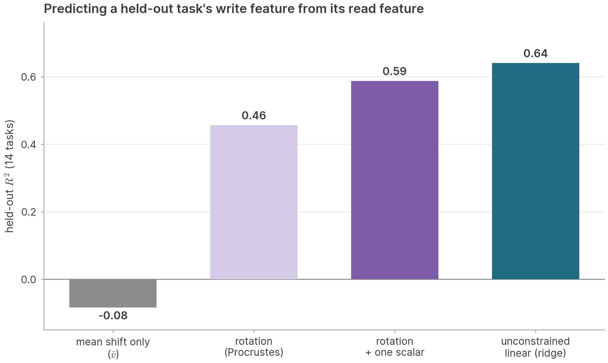

**But not a low-dimensional one.**

Is the rotation secretly low dimensional? We run PCA on the 55 train tasks' $u_A$, keep only
the top $k$ read components, and fit the map (rotation + scalar, or unconstrained linear)
from those $k$ coordinates alone, scoring on the held-out tasks. Held-out $R^2$ rises
steadily with $k$ — 0.14 at $k=1$, 0.18 at $k=2$, 0.27 at $k=4$, 0.36 at $k=8$, 0.48 at
$k=16$, 0.54 at $k=32$ — with no plateau before the full 54-dimensional train span (0.59).
At every $k$ the rotation of $k$ read components recovers 80–85% of the ceiling set by the
write feature's *own* top-$k$ principal components, so the map is not the bottleneck: the
task identity carried across 69 tasks is itself high dimensional (32 read / 28 write
directions for 90% of the variance), and the rotation transports all of it, not a
handful of privileged directions. The unconstrained linear map from the same $k$
coordinates does no better, so nothing beyond a rotation and one scalar is gained at any
$k$ either.

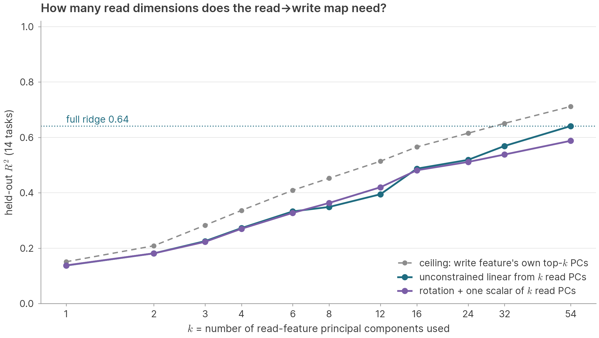

**In detail.**

**Data.** X = task-unique part $u_A$ of the read feature (mean of the carrier-projected L5–7
task means, `label_resid_means`; per-prompt variant built the same way from
`label_resid_perprompt`), Y = task FV (mean of the 150 per-prompt FVs); 55 train / 14
held-out, fp64. Source: `understanding_read_write_linear_map/meanresid_map/`
(`claim6_meanresid_map.py`).

**Congruence.** All-69 family-centered pairwise cosines: read vs write Pearson 0.932,
Spearman 0.906; centered-norm correlation 0.780; gram-CKA 0.924. Subspace overlap in
activation space: principal cosines between the 90%-variance subspaces (32 read vs 28 write
dims): max 0.258, median 0.090. Cross-family matched cos($u_A$, $v_A$) centered: mean 0.064,
mismatched pairs ≈ 0 (−0.000); matched exceeds the mismatched 95th percentile for 36/69
tasks.

**Fits.** Predictor: $\hat v_A = \bar v + s \cdot R\,(u_A - \bar u)$ with means from the
train tasks; $R$ by orthogonal Procrustes on the 55 centered train pairs; $s = 1$ (rotation)
or the trace-formula scalar (rotation+scale); ridge = dual with intercept, $\lambda$ by
LOO-CV (picks the smallest value on the grid, 0.01). Held-out $R^2$ (test-mean reference),
task centroids / per-prompt read features: ridge 0.641 / 0.531; rotation+scale 0.588 /
0.484 ($s = 1.66$; centered read norms 28.2 vs FV 47.7); rotation alone 0.457 / 0.419;
train-mean baseline −0.084. Train-mean-reference $R^2$: ridge 0.669, rotation+scale 0.620.
Held-out mean cos of centered predictions: rotation 0.80, ridge 0.83. The fitted ridge
map's singular spectrum on the train span decays smoothly ($\sigma_{10}/\sigma_1 \approx 0.67$,
$\sigma_{40}/\sigma_1 \approx 0.40$) — the 8% it adds over the rotation is
direction-dependent gain, not a different geometry. For reference, the raw single-layer
read feature gives the same picture (ridge / rotation+scale: $m_A(\mathrm{L6})$ 0.642 / 0.586
with $s = 1.55$; $m_A(\mathrm{L13})$ 0.657 / 0.624 with $s = 0.93$).

**$k$-dimensional maps.** PCA on the 55 train $u_A$ (train-centered); the top-$k$ read
components are the only input. "Linear" = ridge from the $k$ scores (LOO-CV $\lambda$);
"rotation+scale" = Procrustes on the rank-$k$ projected read features; "write ceiling" =
held-out FVs projected onto their own top-$k$ train write PCs (the best any rank-$k$
output can do); "read recon" = held-out read variance kept by the $k$ read PCs. Held-out
$R^2$, test-mean reference:

| $k$ | linear | rotation+scale | write ceiling | read recon | train var. kept |
|---:|---:|---:|---:|---:|---:|
| 1 | 0.138 | 0.138 | 0.151 | 0.165 | 0.16 |
| 2 | 0.181 | 0.181 | 0.209 | 0.204 | 0.26 |
| 4 | 0.273 | 0.270 | 0.336 | 0.312 | 0.41 |
| 8 | 0.349 | 0.363 | 0.453 | 0.408 | 0.55 |
| 16 | 0.487 | 0.481 | 0.566 | 0.510 | 0.74 |
| 32 | 0.569 | 0.538 | 0.651 | 0.568 | 0.94 |
| 54 (all) | 0.641 | 0.588 | 0.712 | 0.616 | 1.00 |

The per-$k$ scalar $s$ falls from 1.99 ($k=1$) to 1.66 (full rank). Per-prompt held-out
$R^2$ follows the same curve about 0.05 lower. Train $R^2$ of the full ridge is 1.00 (55
points in 4096 dimensions interpolate), of rotation+scale 0.94; at $k=4$ both are 0.44–0.45
against 0.27 held-out.


## I. Estimator variant: ten-site-average read features

Every quantity in this paper estimates the read feature from the residual at the **last
token of the final demonstration's target** (150 prompts per task). An alternative
estimator averages the same residual over **all ten** demonstrations' target tokens before
taking the task mean — ten times more sites, and therefore a lower-noise estimate of the
same feature, at the cost of blending in shallow-context positions. The two estimators'
task-unique directions nearly coincide ($|\cos(\hat u_A^{\mathrm{final}},
\hat u_A^{\mathrm{avg10}})|$: median 0.978, min 0.967 over the 69 tasks), and every qualitative
result is identical under both; the ten-site average gives sharper numbers exactly where
estimation precision matters (few-direction ablation bases, regression inputs), and
indistinguishable numbers for prompt-mean-level steering:

| Result (69-task mean) | final-site (main text) | ten-site avg |
|---|---:|---:|
| Task-unique 11-dir ablation, own mean-abl (6-shot, base 0.629) | 0.095 | 0.063 |
| — top-3 SVD | 0.099 | 0.066 |
| — top-1 direction | 0.146 | 0.103 |
| — top-3, L6–9 band only | 0.135 | 0.096 |
| — task-unique part $\hat u_A$, L5–7 (main text) | 0.132 | 0.097 (SVD top-1) |
| Single-direction swap steering, best aggregate $\alpha$ | 0.309 ($\alpha u_A$ grid; 0.327 on the SVD grid) | 0.341 (SVD grid) |
| Read→write ridge, held-out per-prompt $R^2$ (peak layer) | 0.557 (L12) | 0.653 (L13) |
| Read→write ridge, held-out centroid $R^2$ | 0.636 | 0.692 |

Counterfactual controls sit at baseline under both estimators, and 1-shot specificity
holds under both.

---

# References

- Todd, E., Li, M. L., Sen Sharma, A., Mueller, A., Wallace, B. C., & Bau, D. (2024).
  *Function Vectors in Large Language Models.* ICLR 2024.
  [arXiv:2310.15213](https://arxiv.org/abs/2310.15213).
- Hu, X., Yin, K., Jordan, M. I., Steinhardt, J., & Chen, L. (2025).
  *Understanding In-context Learning of Addition via Activation Subspaces.*
  [arXiv:2505.05145](https://arxiv.org/abs/2505.05145).
